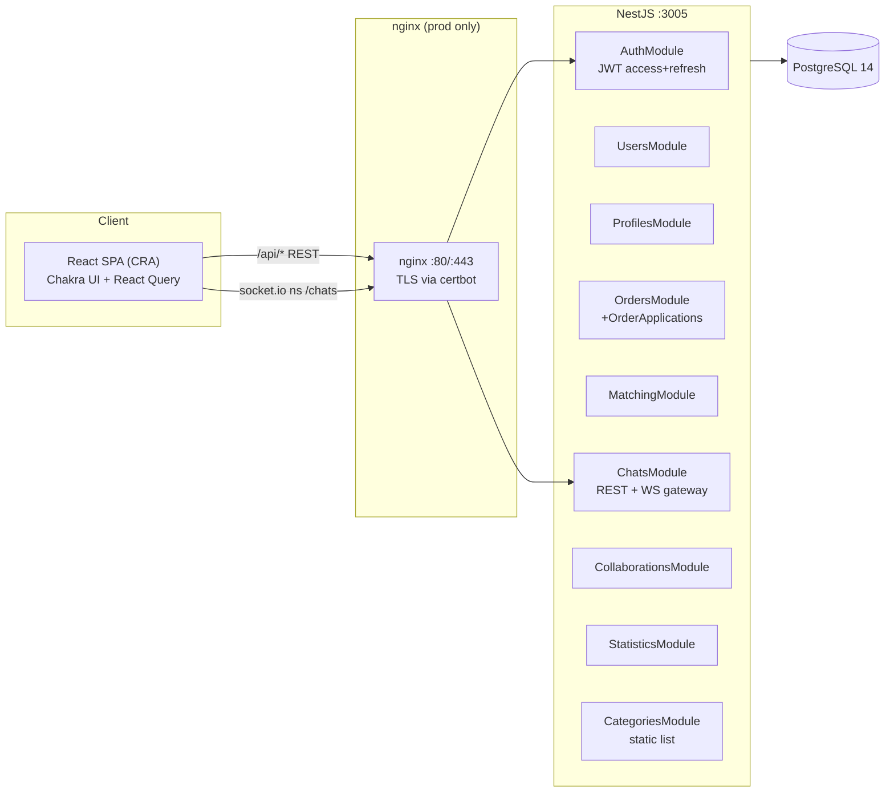
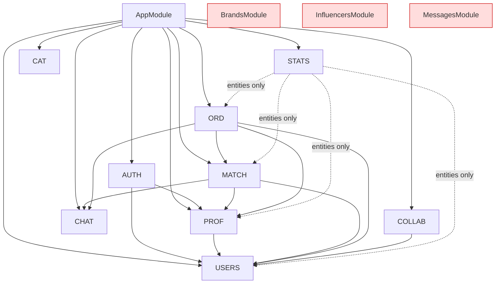

# AdPartners.kz — Full Repository Audit

**Date:** 2026-06-10 · **Branch:** `audit/fixes` · **Scope:** complete repository (architecture, structure, backend, frontend, database, Docker/deploy, env vars, security, docs, tests, defense readiness).
**Verification status:** backend `nest build` ✅ exit 0 · frontend `tsc --noEmit` ✅ exit 0 · runtime end-to-end deploy **Not Verified** (no live server in audit environment).

Companion documents: [FIX_PLAN.md](FIX_PLAN.md) · [SECURITY_AUDIT.md](SECURITY_AUDIT.md) · [REPOSITORY_CLEANUP.md](REPOSITORY_CLEANUP.md) · [ENVIRONMENT_VARIABLES.md](ENVIRONMENT_VARIABLES.md) · [DIPLOMA_DEFENSE.md](DIPLOMA_DEFENSE.md)

> Supersedes the 2026-06-09 audit. Items already fixed in commit `6664b8e` (env-var name alignment, prod frontend service, CORS scoping, `DB_SYNCHRONIZE` bootstrap) are no longer listed as findings.

---

## 1. Project Overview

**Business purpose.** AdPartners.kz is a two-sided marketplace connecting brands with influencers in Kazakhstan/CIS. Brands publish campaign orders; influencers apply; accepted applications become matches/collaborations with real-time chat and KPI dashboards. Bachelor diploma project (SDU University, 2025).

**Stack (verified in code):**

| Layer | Technology | Evidence |
|---|---|---|
| Frontend | React 18 + Create React App, Chakra UI 2, React Router 6, TanStack Query 5, axios, socket.io-client | `frontend/package.json` |
| Backend | NestJS 10, TypeORM 0.3, Passport-JWT, socket.io gateway, Swagger | `backend/package.json` |
| Database | PostgreSQL 14 (alpine), schema via `synchronize` | `docker-compose*.yml`, `app.module.ts:50` |
| Infra | Docker Compose (dev + prod), nginx + certbot TLS | `docker-compose.prod.yml`, `nginx/site.conf` |
| Integrations | none external (no S3/MinIO, no AI, no payments) | dependency scan |

### Architecture diagram

### Module dependency graph (backend, as wired in `app.module.ts`)

`BrandsModule`, `InfluencersModule`, `MessagesModule` exist on disk but are **not imported** in `app.module.ts` — dead modules (see §2).

---

## 2. Repository Structure Review

Full keep/refactor/delete inventory: [REPOSITORY_CLEANUP.md](REPOSITORY_CLEANUP.md). Highlights:

**Dead code (verified unreferenced):**
- `backend/src/brands/`, `backend/src/influencers/`, `backend/src/messages/` — modules never imported into `AppModule`. `influencers.controller.ts` and `influencers.service.ts` are **1-byte empty files**. `messages.controller.ts` has **no auth guard at all** — harmless only because it is unwired; importing `MessagesModule` later would instantly expose unauthenticated read/write/delete of all messages.
- Root `src/matching/matching.service.ts` and `src/orders/orders.module.ts` — stray AI-editing artifacts at repo root containing literal `// ... existing code ...` placeholders. Committed to git.
- Root `package.json` + `package-lock.json` (sole dependency `react-icons`) — accidental.
- Frontend dead files (zero imports, verified by grep): `pages/Home.tsx`, `pages/NotFound.tsx`, `pages/brand/Campaigns.tsx`, `pages/brand/Influencers.tsx`, `pages/brand/InfluencerRecommendations.tsx`, `pages/brand/MatchRecommendations.tsx`, `components/auth/PublicRoute.tsx`, `components/Header.tsx`, `components/SearchIcon.tsx`, `components/statistics/StatsCard.tsx`, `components/statistics/StatCard.tsx`, `services/mockData.ts`, `services/match.ts`, all of `src/mocks/` (3 files).
- `backend/src/app.controller.ts` / `app.service.ts` — Hello-World controller **not registered** in AppModule; its e2e test (`test/app.e2e-spec.ts`) therefore fails with 404.
- `backend/src/scripts/` — six one-off DB-repair scripts/SQL from an old chat-schema incident; superseded by the two migrations and the admin endpoints.

**Duplicated logic:**
- Two `Message` entities: `chats/entities/message.entity.ts` (live) vs `messages/entities/message.entity.ts` (dead twin).
- `frontend/src/types/message.ts` vs `types/messages.ts` — overlapping definitions, each imported once.
- `users` table duplicates profile data (`bio`, `avatarUrl`, `categories`, `languages`, `location`, `industry`, …) that also lives in `profiles` (§5).
- Order assignment exists twice: `POST /orders/:id/apply` (direct claim, `orders.service.ts:67-85`) and the application→accept flow (`order-applications.service.ts:98-213`) — two divergent state machines for the same business event.

**Lockfile noise:** both `yarn.lock` **and** `package-lock.json` committed in `backend/` and `frontend/`. Dockerfiles use npm — the yarn locks should go.

**Local-only junk (untracked):** `.DS_Store`, `.idea/`, `frontend/.env` (`HTTPS=false`, harmless). `.gitignore` already covers them.

---

## 3. Backend Audit

**Strengths.** Clean NestJS domain-module layout; DTO validation on most write paths; JWT access+refresh with hashed refresh-token storage (`users.service.ts:85-92`); bcrypt(10); ownership enforcement done properly in `MatchingService.findOwnedMatch` (`matching.service.ts:38-50`) and `order-applications.service.ts:104-129`; Swagger annotations throughout; defensive statistics aggregation (`safeNumber`).

**Critical / high problems** (severity-tagged list in [SECURITY_AUDIT.md](SECURITY_AUDIT.md)):

1. **Self-registration as ADMIN.** `RegisterDto.role` is `@IsEnum(UserRole)` (`auth/dto/register.dto.ts:20-21`) and `UserRole` includes `ADMIN`. `POST /auth/register {"role":"admin"}` grants every `@Roles(ADMIN)` endpoint (chat maintenance, all-collaborations listing, collaboration delete).
2. **Any user can delete any user.** `DELETE /users/:id` has no ownership/role check (`users.controller.ts:61-64`). `PATCH /users/:id` *does* check ownership — the asymmetry is an oversight, not a design choice.
3. **`POST /users` mints arbitrary-role users** for any authenticated caller, bypassing registration (no profile created → downstream `findByUserId` 404s) (`users.controller.ts:16-19`).
4. **`GET /auth/profile` leaks `password` and `refreshToken` hashes.** `JwtStrategy.validate` returns `{ ...user, sub }` (`jwt.strategy.ts:22-25`) — the spread strips the `User` prototype, so `instanceToPlain` in `TransformInterceptor` cannot apply `@Exclude`. Every request's `req.user` carries the hashes; `/auth/profile` returns them verbatim.
5. **WebSocket `joinChat` has no membership check** (`chats.gateway.ts:82-89`): any authenticated socket can join any `chat:<id>` room and live-read both sides' messages. Gateway CORS is `origin: '*'` (`chats.gateway.ts:17-22`).
6. **Race conditions.** `orders.apply` is read-check-write without transaction/lock (`orders.service.ts:67-85`) — two influencers can both claim an open order. Application-accept spans 4+ writes (order, match, chat, reject-others) with no transaction (`order-applications.service.ts:135-210`).
7. **Global `ValidationPipe` lacks `whitelist`/`forbidNonWhitelisted`/`transform`** (`main.ts:18`). Unknown body props pass through; with `Object.assign(profile, profileData)` (`profiles.service.ts:58`) and `UpdateProfileDto.type` being legal, a user can flip their profile type brand↔influencer.
8. **Collaborations have no ownership checks:** any brand can create a collaboration naming any `brandId`/`influencerId` (`collaborations.controller.ts:18-23`) and `PATCH` any collaboration (`:53-58`). `GET /order-applications/:id` likewise returns anyone's application (`order-applications.controller.ts:63-72`).
9. **No helmet, no rate limiting** — `@nestjs/throttler` absent; login/register brute-forceable.

**Bugs (non-security):**
- **Date-range filter bug:** `statistics.service.ts:53-58, 86-87, 140-141, 162-163` assign `where.createdAt` twice — when both `startDate` and `endDate` are given, only `endDate` survives. Needs `Between()`.
- **Prod realtime chat broken:** frontend builds the socket URL as `io(baseURL + '/chats')` (`frontend/src/services/socket.ts:23`). In prod `baseURL = https://DOMAIN/api`, so the socket.io *namespace* becomes `/api/chats` ≠ gateway namespace `chats` → connection rejected. Works in dev only because the dev baseURL has no path.
- **`ILike` on an array column:** `users.service.ts:29` applies `ILike('%…%')` to `categories text[]` — Postgres errors at runtime when `GET /users/influencers?category=…` is used.
- **Broken inverse relation:** `User.orders = OneToMany(Order, order => order.brand)` (`user.entity.ts:70`) but `Order.brand` is a **Profile**. `Order.brandUser` (`order.entity.ts:87`) is an extra never-populated relation.
- **e2e test fails:** `AppController` unregistered → `GET /` 404 vs expected 200.
- `JWT_ACCESS_EXPIRATION`/`JWT_REFRESH_EXPIRATION` are read into config (`configuration.ts:16-17`) but TTLs are **hardcoded** `'15m'`/`'7d'` in `auth.service.ts:95,104` and `auth.module.ts:22`; ChatsModule registers a third JwtModule with `expiresIn: '1d'` (`chats.module.ts:19`).
- `auth.service.deleteAccount` throws bare `Error` → HTTP 500 (`auth.service.ts:139`).
- 50 `console.*` calls in `backend/src` (entities, IDs logged) instead of Nest `Logger`.
- Admin maintenance endpoints reach into private fields via `this.chatsService['messagesRepository']` (`chats.controller.ts:48,71,108,152`) — encapsulation break; these one-off repair endpoints belong in scripts.
- `/auth/refresh` verifies with the shared secret and no token-type claim (`auth.service.ts:60-85`); misuse is blocked only by the bcrypt compare against the stored refresh hash — works, but fragile by construction.

---

## 4. Frontend Audit

**Strengths.** Role-aware routing via `ProtectedRoute` (`App.tsx:36-52`); single axios instance with single-flight refresh rotation and request replay (`services/api.ts:26-122`) — genuinely well built; clean AuthContext; zero TypeScript errors.

**Issues:**
- **Tokens in `localStorage`** (`api.ts:15`, `AuthContext.tsx:57-58`) — XSS-readable. Acceptable for a demo; know the httpOnly-cookie answer for the defense.
- **~17 dead files** (§2) including an entire unused mock-data layer — looks unfinished to any reviewer browsing the repo.
- **State-management split-brain:** React Query is installed and instantiated (`App.tsx:29`) but most pages do manual `useEffect`+axios+`useState`.
- **404:** custom `NotFound.tsx` exists but the route renders inline `
404 Not Found
` (`App.tsx:142`).
- **Duplicates:** `types/message.ts` vs `types/messages.ts`; `services/match.ts` (dead) vs `services/matching.ts` (live).
- **No global error boundary** — one render exception whites out the SPA.
- **Accessibility:** Chakra baseline only; not systematically handled. **Not Verified** against WCAG.
- **CRA is deprecated** (react-scripts 5, TS 4.9) — fine for a diploma, wrong answer for "production plans".

---

## 5. Database Audit

Schema comes entirely from TypeORM `synchronize` over 9 entities. The 2 files in `backend/src/migrations/` are old data-repair scripts, not a baseline; no datasource config or `migration:run` script exists — **migrations are effectively absent**.

- **`users` is a god-table** mixing identity with influencer metrics (`followers`, `engagementRate`, `categories`) and brand fields (`industry`, `totalSpent`), all nullable (`user.entity.ts:97-139`), while `profiles` holds the same concepts again. Two sources of truth: matching reads `profiles.categories`, user-search reads `users.categories`.
- **FK target inconsistency:** `orders.brand_id`/`influencer_id` → **profiles.id**, but `match.brandId`/`influencerId` → **users.id**, and `collaborations.*Id` → users.id. Statistics must bridge both ID spaces (`statistics.service.ts:44-52,85`). The single most confusing design decision in the codebase.
- **Missing indexes:** none beyond PKs/unique email. Postgres does not auto-index FKs — `orders.status`, `orders.brand_id`, `message."chatId"`, `match(brandId,influencerId)`, `order_application(order,applicant)` all unindexed.
- **Missing constraints:** no unique on `match(brandId, influencerId)` (uniqueness only app-enforced, racy); no unique pair on `chat(sender,recipient)`; no CHECK on `order.budget`; `order.deadline` is a **string** column (`order.entity.ts:52-53`); `chat.unreadCount` is one counter for both participants (sender's own messages inflate their "unread").
- **Duplicate KPI storage:** `match.stats` jsonb *plus* `engagementRate`/`conversionRate`/`clickThroughRate` int columns (`match.entity.ts:58-71`).
- **Seed data:** none committed. A demo needs a committed seed script (one existed only as `/tmp/seed.sh` in a working session).

---

## 6. Docker & Deployment Audit

**Dev (`docker-compose.yml`):** postgres (healthcheck ✅, port 5435) + backend (target `development`, bind mount, `npm install && build && start:dev`) + frontend (static nginx, port 3000). **Starts from scratch: yes** — schema auto-created via synchronize. Weakness: backend `depends_on` has no `condition: service_healthy` in dev, so first boot may crash-loop until postgres is ready (`restart: always` hides it).

**Prod (`docker-compose.prod.yml`):** env-driven, DB healthcheck gating ✅, nginx TLS + certbot renew loop, DB not port-exposed ✅, CORS scoped to `https://${DOMAIN}` ✅. Remaining risks:
- **Certbot chicken-and-egg:** `nginx/site.conf:18-19` references `/etc/letsencrypt/live/adpartners.kz/fullchain.pem` at startup; on a fresh VPS nginx exits before certbot can answer the challenge. DEPLOY.md lacks the bootstrap step (`certbot certonly --standalone` first, or a temporary HTTP-only config). **Not Verified** live.
- **Prod socket.io namespace mismatch** (§3) — realtime chat will not work after deploy even though nginx proxies `/socket.io/` correctly.
- **No `/health` endpoint and no backend healthcheck** in either compose file.
- `backend/Dockerfile`: prod stage `npm install --only=production` (deprecated; use `npm ci --omit=dev`) then **copies node_modules from the dev stage anyway** (line 27), defeating the prune; dev-stage `RUN npm run build` is redundant with the compose command.
- `frontend/` has **no `.dockerignore`** — host `node_modules` enters the build context and `COPY . .` can clobber the freshly installed modules.
- `version: '3.7'` in dev compose is obsolete.
- `DB_SYNCHRONIZE=true` default in `.env.prod.example` — deliberate demo bootstrap, but schema-sync-in-prod is the first thing a production reviewer flags.

---

## 7. Environment Variables

Full table: [ENVIRONMENT_VARIABLES.md](ENVIRONMENT_VARIABLES.md). Names are **aligned** since `6664b8e`. Remaining: decorative TTL vars (set in compose, hardcoded in code); `JWT_SECRET` dual-read path — `configuration.ts:15` default `'super-secret'` is dead code because `auth.module.ts:20` / `jwt.strategy.ts:15` / `chats.module.ts:17` read the raw env var, and the app **fails to boot** if it's unset outside compose; weak dev defaults committed in `docker-compose.yml:39`.

**No real secrets committed** — dev compose holds placeholders (`postgres/postgres`, `your-secret-key-change-in-production`); `.env.prod.example` holds `CHANGE_ME` values; `frontend/.env` (untracked) holds only `HTTPS=false`.

---

## 8. Security Audit

Severity-tagged, OWASP-mapped findings: [SECURITY_AUDIT.md](SECURITY_AUDIT.md). Tally: **4 Critical · 6 High · 7 Medium · 5 Low.**

Clean areas: SQL injection **not found** (parameterized everywhere, incl. raw `$1` queries); XSS — React escaping, no `dangerouslySetInnerHTML` (grep-verified); CSRF — token-in-header, not cookie-based, so largely N/A; SSRF / file upload — features don't exist.

---

## 9. Documentation Audit

19 markdown files, ~4 800 lines. Per-file disposition: [REPOSITORY_CLEANUP.md](REPOSITORY_CLEANUP.md). Calls:
- `README.md`, `DEPLOY.md` — keep; accurate post-`6664b8e`, but DEPLOY.md must add the certbot bootstrap step.
- `docs/diploma/*` (11 files) — thesis working set; keep through the defense. `11_REPOSITORY_ANALYSIS_REPORT.md` duplicates this audit → delete.
- `REVIEW_FIXES_AND_REFLECTION.md`, `backend/src/scripts/README*.md` — historical one-off notes → delete (with the scripts).
- `docs/DOCUMENTATION_AUDIT.md` → superseded by REPOSITORY_CLEANUP.md; `docs/DIPLOMA_DEFENSE_BRIEF.md` → superseded by DIPLOMA_DEFENSE.md. Delete both after review.
- Missing: a real `ARCHITECTURE.md` (seed it from §1); `frontend/README.md` is empty.

---

## 10. Testing Audit

- Backend: 1 unit spec for the unregistered Hello-World controller (passes vacuously) + 1 e2e spec that **fails** (404). Business-logic coverage: **0%**.
- Frontend: CRA boilerplate `App.test.tsx` only.
- Untested critical paths: register/login, refresh rotation, order apply/accept state machine, match accept→chat seeding, every ownership guard.
- Minimum viable for the defense: unit tests for `calculateMatchScore` + `calculateCategoryMatch` (pure functions — and the "algorithm" examiners will probe), auth service specs, one e2e happy path (register→login→create order→apply→accept). See FIX_PLAN Phase 3.

---

## 11. Diploma Defense Readiness

**Strongest:** real two-sided domain; clean NestJS decomposition; working JWT refresh rotation on both ends; real-time chat; prod compose with TLS; Swagger; unusually thorough thesis docs.

**Weakest (examiners will hit these):** zero meaningful tests; `synchronize` instead of migrations; users/profiles duplication + mixed FK targets; dead modules and stray root files visible in 30 seconds of browsing; matching = Jaccard overlap (defensible — own it as deliberate simplicity); live security holes if anyone probes Swagger during the demo.

Questions, answers, and demo script: [DIPLOMA_DEFENSE.md](DIPLOMA_DEFENSE.md).

---

## 12. Scores & Verdict

| Area | Score | Rationale |
|---|---|---|
| Architecture | 6/10 | Clean module layout undermined by dual ID spaces, dead modules, duplicated assignment flows |
| Backend | 5/10 | Solid framework usage; authz gaps, races, §3 bugs |
| Frontend | 5/10 | Works, type-checks; dead code, split state management, no error boundary |
| Database | 4/10 | God-table, mixed FK targets, no migrations/indexes/constraints |
| Security | 3/10 | 4 criticals — all cheap to fix |
| DevOps | 6/10 | Prod compose with TLS is above diploma average; certbot bootstrap + healthchecks missing |
| Documentation | 7/10 | Extensive, mostly accurate, needs dedup |
| Production readiness | 4/10 | Would deploy, then break (socket ns, certbot, no monitoring/backups) |
| Diploma readiness | 7/10 | Demoable today on dev compose; comfortably defensible after FIX_PLAN Phases 1–2 |

**Verdict: Demo Ready.** Not production-ready. **Diploma Ready after FIX_PLAN Phase 1 (≈1 day) + Phase 2 (≈1–2 days).**
