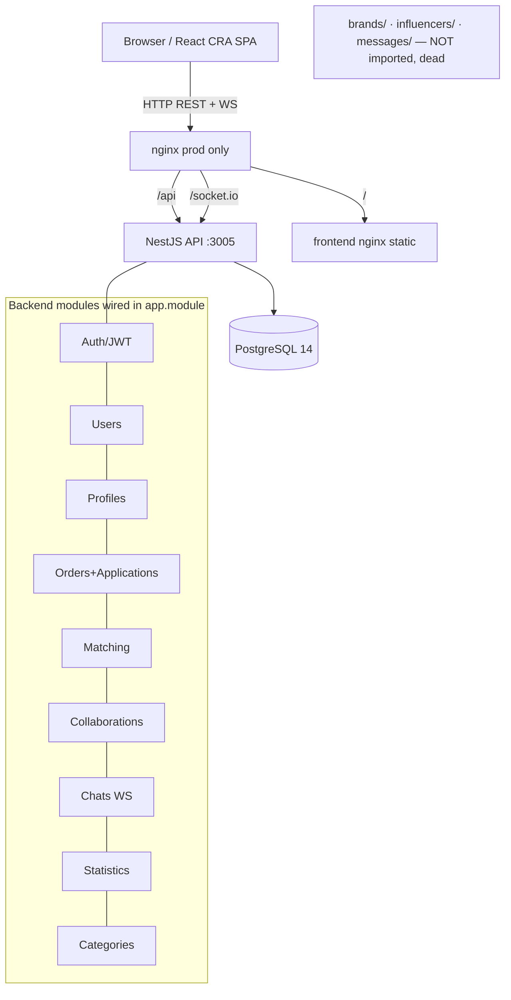

# AdPartners.kz — Repository Audit

**Date:** 2026-06-09 · **Scope:** full-stack audit (architecture, Docker, backend, frontend, database, security) · **Mode:** documentation only, no code changed.

This single document consolidates Phases 1–8 of the audit. Remediation lives in [FIX_PLAN.md](FIX_PLAN.md); env vars in [ENVIRONMENT_VARIABLES.md](ENVIRONMENT_VARIABLES.md); markdown cleanup in [DOCUMENTATION_AUDIT.md](DOCUMENTATION_AUDIT.md).

---

## 1. Project Overview

AdPartners.kz is a full-stack web platform connecting brands with influencers in Kazakhstan/CIS. B2B2C, role-based (BRAND, INFLUENCER, ADMIN/manager). Core flows: auth, profiles, orders/campaigns, applications, collaborations, real-time chat, statistics.

**Actual stack (verified in code — differs from thesis PDF):**

| Layer | Reality | PDF/Slides claim | Match? |
|---|---|---|---|
| Frontend | React 18 + **Create React App** (`react-scripts`) + Chakra UI + React Router 6 + axios + react-query + socket.io-client | React + **Vite** + Chakra | ⚠️ CRA, not Vite |
| Backend | NestJS 10 + TypeORM 0.3 + PostgreSQL 14 + Passport-JWT + socket.io | NestJS + TypeORM + PG | ✅ |
| Object storage | **none** | MinIO (S3), pre-signed URLs, UploadsModule | ❌ does not exist |
| AI | **none** | Gemini (planned) | ✅ correctly "planned" |
| Auth token store | **localStorage** | HttpOnly cookie | ⚠️ localStorage |
| Deploy | Docker Compose (dev: db+backend; prod: +frontend+nginx+certbot) | one-command full stack | ⚠️ dev command omits frontend |

**Data model (9 live entities):** User → Profile (1:1) → SocialMedia (1:N); User → Order (1:N) → OrderApplication (1:N); Match; Collaboration; Chat → Message (1:N). `brand`, `influencer`, second `message` entities exist but their modules are never imported (dead).

---

## 2. Repository Audit (findings)

Severity: 🔴 Critical (blocks run/deploy) · 🟠 High (core feature broken) · 🟡 Medium · ⚪ Low.

| # | Sev | Location | Finding | Impact |
|---|---|---|---|---|
| F1 | 🔴 | [docker-compose.prod.yml:30-32](../docker-compose.prod.yml#L30) vs [configuration.ts:6-7](../backend/src/config/configuration.ts#L6) | Compose sets `DATABASE_USERNAME`/`DATABASE_PASSWORD`; app reads `DB_USERNAME`/`DB_PASSWORD`. Names differ. | Prod backend ignores compose creds, falls back to `postgres/postgres`, but prod DB user is `${DB_USER}=adpartners` → **DB auth fails, backend cannot start**. Dev survives only because fallback matches dev creds. |
| F2 | 🔴 | [frontend/src/services/api.ts:3](../frontend/src/services/api.ts#L3) vs [frontend/Dockerfile:6](../frontend/Dockerfile#L6) / [docker-compose.prod.yml:47](../docker-compose.prod.yml#L47) | Frontend reads `REACT_APP_API_BASE_URL`; build arg passed is `REACT_APP_API_URL`. | Prod bundle ignores the arg, bakes fallback `http://localhost:3005`. **Deployed UI calls localhost, never nginx `/api` → whole app non-functional in prod.** |
| F3 | 🔴 | [configuration.ts:9](../backend/src/config/configuration.ts#L9), `src/migrations/` | `synchronize:false` in prod; only 2 *chat-fix* migrations, no base-schema migration, no `migrationsRun`. | **Fresh prod DB has no tables.** Backend errors on first query. |
| F4 | 🟠 | [docker-compose.yml](../docker-compose.yml) | Default/dev compose defines only `postgres`+`backend`. No frontend service. | `docker compose up --build` (the documented command) does **not** start the UI. Contradicts thesis claim of one-command full stack. |
| F5 | 🟠 | whole repo | No MinIO, multer, aws-sdk, s3, or Gemini references anywhere; no `UploadsModule`. | Thesis PDF + slides describe MinIO object storage, pre-signed uploads, profile/campaign media, `UploadsModule` in detail. **Feature does not exist** — defense liability if examiner asks to demo it. `profileImageUrl` is a plain string column only. |
| F6 | 🟡 | [app.module.ts:24-63](../backend/src/app.module.ts#L24) vs `brands/`, `influencers/`, `messages/` | `BrandsModule`, `InfluencersModule`, `MessagesModule` exist but are never imported. | Dead code. Their controllers/routes never register. `messages/` duplicates the live `chats/` messaging (two `Message` entities). Confuses reviewers. |
| F7 | 🟡 | repo root `src/`, root `package.json` | Stray `src/matching/matching.service.ts`, `src/orders/orders.module.ts`, and a root `package.json` with only `react-icons`. | Duplicate/dead; misleads anyone reading the tree. |
| F8 | 🟡 | [main.ts:11](../backend/src/main.ts#L11) | `app.enableCors()` with no origin allowlist. | Any origin may call the API. Tighten for prod. |
| F9 | 🟡 | [backend/src/scripts/](../backend/src/scripts/) | Ad-hoc SQL/TS fix scripts (`direct-fix.sql`, `fix-database.ts`, `add-recipient.sql`…) committed. | Signals schema was patched by hand rather than via migrations; not part of a clean build. |
| F10 | ⚪ | [backend/Dockerfile:29](../backend/Dockerfile#L29) | `EXPOSE 3000` but app listens on `PORT=3005`. | Cosmetic; documentation drift. |
| F11 | ⚪ | [frontend/src/mocks/](../frontend/src/mocks/) | `mocks/` not imported by any page/service. | Dead code. |
| F12 | ⚪ | [frontend/README.md](../frontend/README.md) | Empty (0 lines). | Looks unfinished. |

---

## 3. Docker & Deployment

**Can a fresh machine run `docker compose up --build`?** Partially. Dev compose brings up Postgres + backend (works by env-fallback luck), but **no frontend** (F4). Frontend must be run separately (`cd frontend && npm start`).

**Prod (`docker-compose.prod.yml`)?** Currently **broken** by F1 (DB creds), F2 (frontend API URL), F3 (no schema). Also depends on `certbot/` cert volumes that must be bootstrapped before nginx will start with TLS ([nginx/site.conf:18-19](../nginx/site.conf#L18) references `/etc/letsencrypt/live/adpartners.kz/...`).

| Aspect | Current | Correct target |
|---|---|---|
| Dev services | postgres, backend | + frontend (or document that UI runs via `npm start`) |
| Env var names | mixed `DB_`/`DATABASE_` | one convention end-to-end |
| Prod schema | synchronize off, no migrations | generate base migration + `migrationsRun:true`, OR set `synchronize:true` for the demo (acceptable for diploma) |
| TLS | hard requires existing certs | document certbot bootstrap, or ship an HTTP-only `site.conf` for local demo |
| Backend EXPOSE | 3000 | 3005 |

Startup ordering and healthchecks are correct (`depends_on: condition: service_healthy` in prod). Volumes (`postgres_data`) persist correctly.

---

## 4. Backend Review

**Good:** clean module-per-domain layout; DTOs with `class-validator`; global `ValidationPipe`; Passport-JWT strategy; `RolesGuard` + `@Roles()` RBAC; bcrypt password hashing (salt 10, [users.service.ts:67](../backend/src/users/users.service.ts#L67)); refresh-token rotation with hashed token stored and `bcrypt.compare` ([auth.service.ts:60-75](../backend/src/auth/auth.service.ts#L60)); WebSocket JWT validation on handshake ([chats.gateway.ts:38-49](../backend/src/chats/chats.gateway.ts#L38)); Swagger at `/docs`.

**Issues:**
- 🟡 Refresh tokens verified with the **same** `JWT_SECRET` as access tokens ([auth.service.ts:62](../backend/src/auth/auth.service.ts#L62)). Use a separate refresh secret.
- 🟡 No rate limiting on `/auth/login` / `/auth/register` (no `@nestjs/throttler`). Brute-force exposure.
- 🟡 Dead modules (F6) inflate the surface; `messages/` vs `chats/` duplication risks confusion about which is canonical.
- ⚪ `JWT_ACCESS_EXPIRATION` / `JWT_REFRESH_EXPIRATION` env vars are **not read** — [configuration.ts:13-14](../backend/src/config/configuration.ts#L13) hard-codes `'15m'`/`'7d'`. The compose env values are decorative.
- ⚪ Global `TransformInterceptor` ("handle circular references") — verify it is not masking serialization bugs.

---

## 5. Frontend Review

**Good:** axios instance with Bearer-token request interceptor; well-implemented single-flight 401 refresh + replay queue ([api.ts:32-122](../frontend/src/services/api.ts#L32)) — matches the "challenge we solved" in the thesis; React Router public/protected routes; react-query; socket.io client.

**Issues:**
- 🔴 F2 env var name mismatch (prod-breaking).
- 🟡 Tokens in `localStorage` (XSS-readable). Thesis claims HttpOnly cookie — mismatch and weaker posture.
- 🟡 Hard-coded fallback `http://localhost:3005`; no frontend `.env.example` documenting `REACT_APP_API_BASE_URL`.
- ⚪ Dead `mocks/` (F11); empty `frontend/README.md` (F12).
- ⚪ CRA (`react-scripts`) is in maintenance mode; fine for a diploma, but contradicts the "Vite" claim in the report.

---

## 6. Database Review

**Engine:** PostgreSQL 14. **ORM:** TypeORM 0.3, explicit `entities[]` array in [app.module.ts:39-49](../backend/src/app.module.ts#L39) (9 entities). Schema created by `synchronize` in dev.

**Findings:**
- 🔴 No reliable fresh-prod setup (F3): synchronize off + incomplete migrations.
- 🟡 Migrations only patch chat/message tables ([1745086101543](../backend/src/migrations/1745086101543-AddChatIdToMessages.ts), [1724111111111](../backend/src/migrations/1724111111111-FixChatMessages.ts)); no migration creates the base schema → DB not reproducible from migrations alone.
- 🟡 Hand-fix scripts in `backend/src/scripts/` (F9) confirm schema drift resolved manually.
- ⚪ Duplicate `Message` entity (chats vs messages) — only the chats one is live.

**Verdict:** dev schema works via synchronize; prod schema is not reproducible. For the diploma demo, enabling `synchronize:true` in the demo profile is the pragmatic fix; for "production-ready", generate a baseline migration.

---

## 7. Security Review

| Sev | Finding | Location |
|---|---|---|
| 🟠 High | Wide-open CORS (`enableCors()` no allowlist) | [main.ts:11](../backend/src/main.ts#L11) |
| 🟠 High | No rate limiting on auth endpoints | `auth/` |
| 🟡 Med | Access tokens in `localStorage` (XSS exfiltration) | [api.ts](../frontend/src/services/api.ts) |
| 🟡 Med | Refresh + access share one JWT secret | [auth.service.ts:62](../backend/src/auth/auth.service.ts#L62) |
| 🟡 Med | Weak default secrets baked in dev compose (`your-secret-key-change-in-production`) and config fallbacks (`'super-secret'`, `postgres/postgres`) | [docker-compose.yml:39](../docker-compose.yml#L39), [configuration.ts:12](../backend/src/config/configuration.ts#L12) |
| 🟢 Low | `JWT_*_EXPIRATION` env not actually read (hard-coded) | [configuration.ts:13-14](../backend/src/config/configuration.ts#L13) |

**Positives:** bcrypt hashing ✅, refresh tokens stored hashed ✅, WS handshake JWT-validated ✅, DTO validation ✅, parameterized TypeORM queries ✅, secrets git-ignored via `.env` ✅, `node_modules` not committed ✅.

No Critical-severity *security* exploit found (the 🔴 items are deployment/correctness, not vulnerabilities).

---

## 8. Scores & Verdict

See [DIPLOMA_DEFENSE_BRIEF.md](DIPLOMA_DEFENSE_BRIEF.md) and the chat summary. Headline: a working dev build with genuinely good auth engineering, undermined by prod-config breakage (F1–F3) and a thesis that documents features (MinIO/uploads/Vite) absent from the code.
