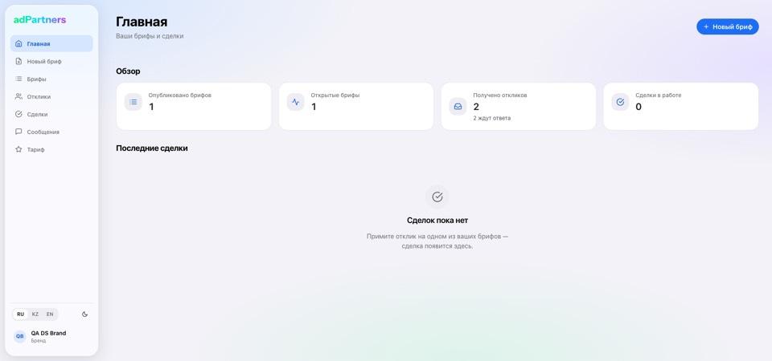
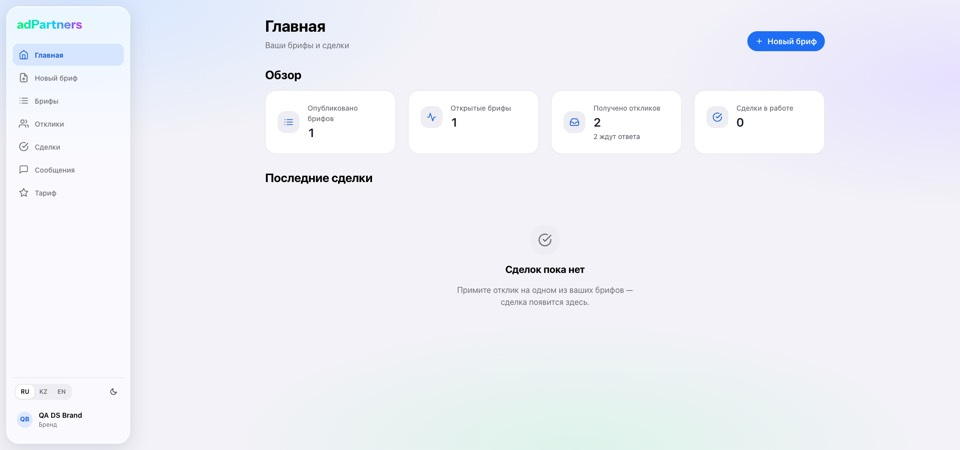
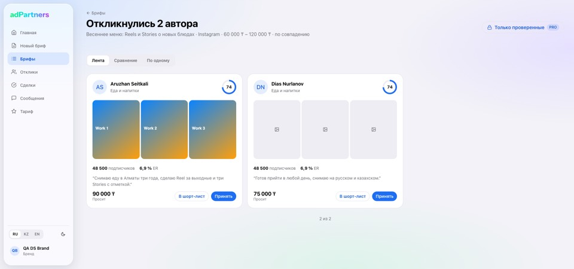
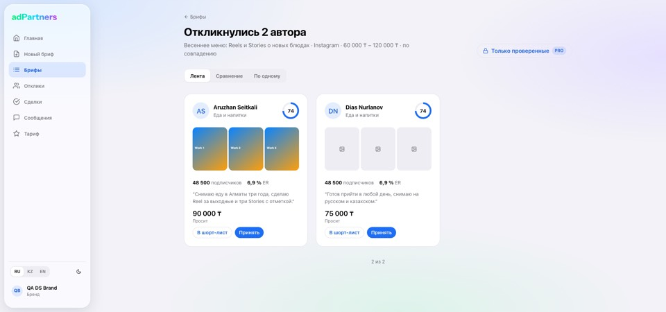
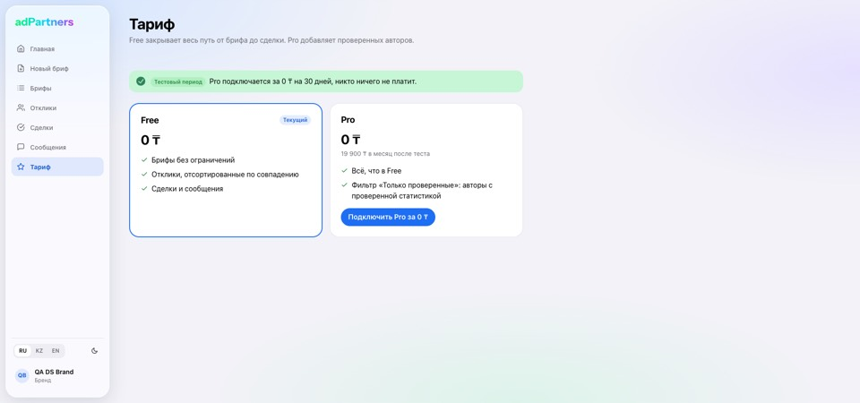
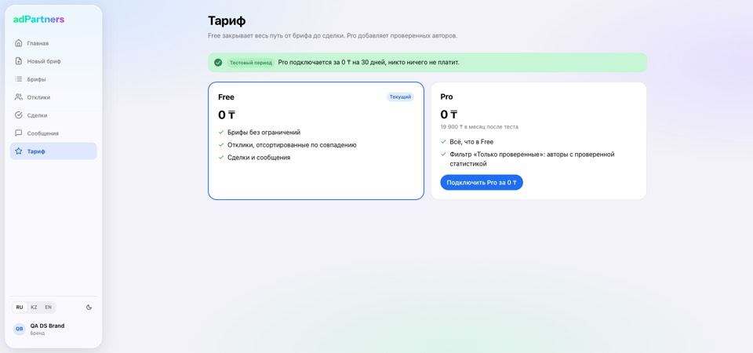
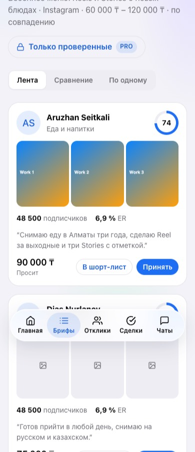
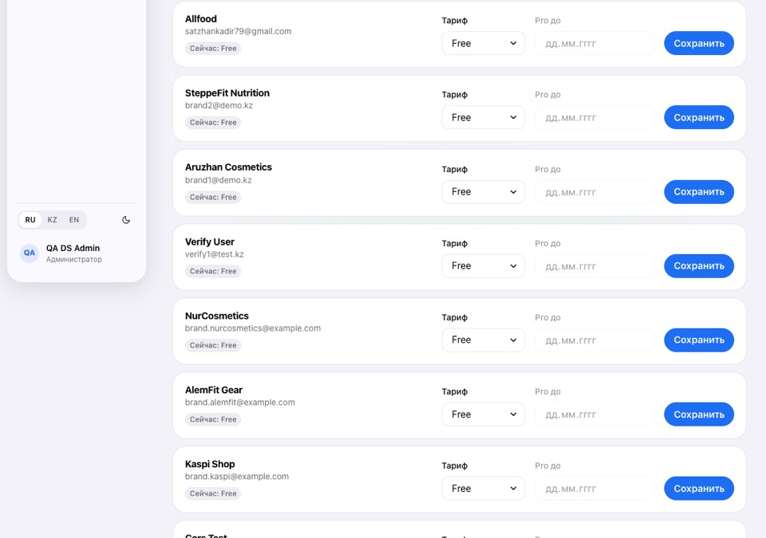
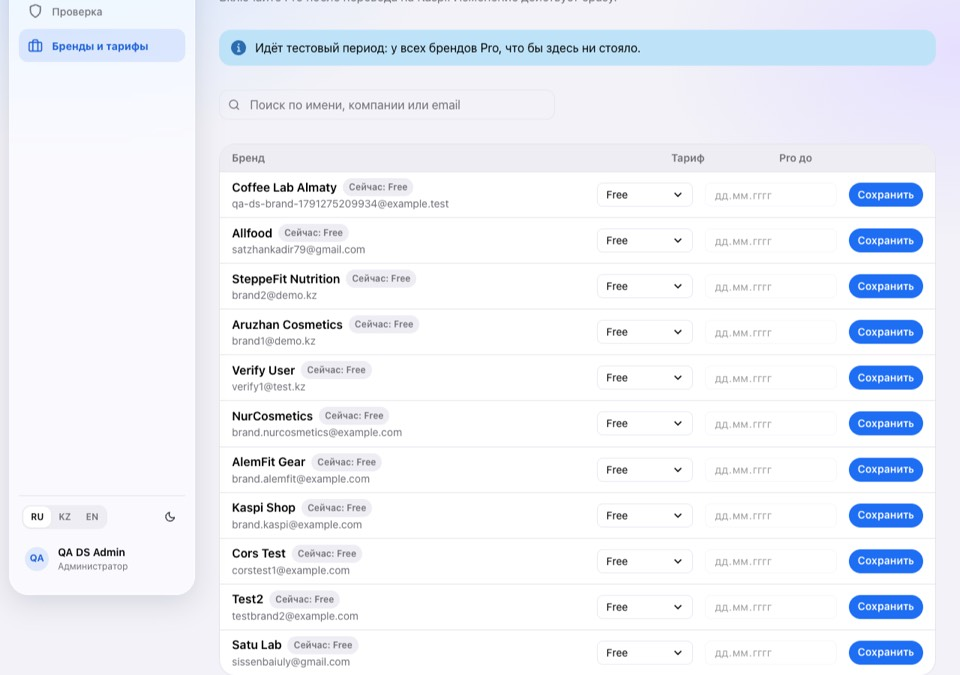

# AdPartners.kz — Project

One reference for the product, the design direction, the UI system as built, the rules that hold and the architecture. It describes the code at the end of PR R4 (`redesign/4-plan`, 2026-10-05). The build plan and its history are in [tasks/todo.md](../tasks/todo.md); environment variables in [ENVIRONMENT_VARIABLES.md](ENVIRONMENT_VARIABLES.md); the deal pipeline decision in [adr/0001-deal-pipeline.md](adr/0001-deal-pipeline.md).

## 1. Product

Status: diploma defended; the goal is a real product for the Kazakhstan market, run as a free test version for now.

### Users and pain
- **Hero user: a small Kazakh brand owner** (an Almaty Instagram shop or café) with no agency and a small budget, who wants local micro-influencers quickly. Works on a laptop or phone between other tasks.
- **Secondary user: a micro-influencer** (5k–50k followers) making Kazakh/Russian content, who wants paid deals without an agency. Works on a phone.
- **Pain:** finding influencers is slow. Today the owner scrolls Instagram/TikTok and DMs creators one at a time.

### Core loop
> Brand posts a brief in ~3 minutes → creators apply within 24–48 h → applicants are ranked by match score → brand accepts one → deal → creator submits a proof link → brand confirms → both rate each other.

Catalogue search and direct invites come after the loop works. Built so far: briefs (wizard, draft → open → cancelled), creator feed and apply, ranked applicants with shortlist, one Deal per accepted application (R2–R3). Proof, confirm/dispute and ratings are R5.

### Business model
| Item | Decision |
|---|---|
| Revenue | Brand subscription, **Free / Pro**, Pro priced at **19 900 ₸/month** |
| Paywall | Pro unlocks the **"Verified only"** filter: creators whose stats an admin has checked |
| Test period (`FREE_TEST_PERIOD=true`, the default) | Nobody is charged. A brand gets Pro through a real checkout for **0 ₸** (`POST /plan/checkout`, 30 days, audit row). The Plan page shows 0 ₸ plus the 19 900 ₸ note. |
| Paid path (test period off) | Brand pays by **Kaspi** transfer; an admin sets Pro in `/admin/brands`. No payment provider. |
| Deal money | Settled off-platform between brand and creator |

Cold start: seed 5–10 real brands with live paid briefs by hand; creators follow the money.

### Data and trust
- Creator stats are self-reported plus an Instagram/TikTok insights screenshot (private file, owner/admin only).
- An admin queue (`/admin/verifications`) approves a claim: the stats are copied into the profile and the creator gets the **Verified** badge. A verified creator can open a new claim on purpose.
- After a completed deal both sides rate each other (R5).

### North-star metric
**Share of briefs that receive ≥ 3 applicants within 48 hours of publishing.** Supporting: deals completed per month, share of brands posting a second brief within 30 days, number of Pro brands.

### Scope and anti-goals
| In | Out (anti-goals) |
|---|---|
| Responsive web, mobile-first for creators | In-app payments (deals and subscriptions stay off-platform or manual) |
| RU (default) + KZ + EN interface | Instagram/TikTok API integration (later; the data model stays ready) |
| Email + password, 6-digit email code on sign-up; password reset (planned) | OAuth, phone OTP, Telegram login (later) |
| Notifications: in-app bell, email, Telegram bot (Phase 7) | WhatsApp (cost + Meta approval) |
| Admin: verification queue, plans, moderation | Agency / multi-brand team features (deferred) |

Before each phase, re-read the anti-goals and cut any step that serves agencies, in-app payments or social APIs.

### Risks
1. **Kazakhstan personal-data localisation law.** Personal data of KZ citizens must be stored on servers in Kazakhstan. This decides hosting and file storage (D2, before Phase 8: a KZ provider with Postgres and S3-compatible storage). Uploads now sit on a private local volume behind `StorageService`, so the backend can be swapped. Verify with a lawyer or an official source before launch.
2. **Supply quality.** Self-reported stats can be gamed; the admin queue is the only defence and does not scale past hundreds of creators.
3. **Manual billing does not scale.** Fine for the first ~50 paying brands.
4. **Paywall value.** "Verified only" is worth paying for only if enough creators are verified; verification must run ahead of the paywall.
5. **Two people, no deadline.** Scope creep is the main threat; every phase ships something usable on its own.

## 2. Design direction

| Step | Decision |
|---|---|
| Purpose | Brand: post a brief and choose a creator fast. Creator: find paid briefs and apply in one tap. |
| Tone | **Creator-energetic** where creators are shown (applicant feed, creator cards, profiles, Landing). **Calm and dense** on brand workflow screens (brief wizard, applicant comparison, deals, admin). |
| Memorable detail | The **applicant feed**: creator cards with a large avatar, content strip (portfolio, up to 6 images), match score ring and Verified badge, which the brand compares or goes through one by one. |
| Visual reference | "Liquid Glass" / Apple HIG: glass chrome over a soft gradient canvas, solid cards for content. |
| Constraints | Chakra UI v2 on Vite; semantic tokens with light/dark; WCAG AA; RU/KZ text is ~30% longer than EN; mobile-first. |

**Anti-patterns:** a generic purple SaaS primary; cards inside cards; feature descriptions written into the UI; invented numbers (e.g. a "82% of briefs…" stat with no data behind it); raw hex colours or palette shades in pages.

## 3. Current UI system (as built, R1–R4)

Source of truth: [frontend/src/index.css](../frontend/src/index.css) (colour variables) and [frontend/src/theme.ts](../frontend/src/theme.ts) (Chakra `extendTheme`). Pages use semantic tokens only.

### Colour
Colours are CSS variables `--ap-*` in `index.css`, defined for light (`:root`), dark (`:root[data-theme='dark']`, which Chakra sets), `prefers-contrast: more` (stronger `--ap-line` and `--ap-muted`) and `prefers-reduced-transparency: reduce` (solid chrome, no blur, flat canvas). `theme.ts` maps semantic tokens onto them:

| Semantic token | Variable | Light | Dark |
|---|---|---|---|
| body background | `--ap-canvas` | 3 radial gradients over `#f2f2f7` | 3 radial gradients over `#000000` |
| `bg.canvas` | `--ap-bg` | `#f2f2f7` | `#000000` |
| `bg.surface` | `--ap-surface` | `#ffffff` | `#1c1c1e` |
| `bg.subtle` | `--ap-subtle` | `#ededf2` | `#2c2c2e` |
| `bg.muted`, `border.default` | `--ap-line` | `#e3e3e8` | `#38383a` |
| `fg.default` | `--ap-fg` | `#000000` | `#f5f5f7` |
| `fg.muted`, `fg.subtle` | `--ap-muted` | `#6c6c72` | `#a1a1a8` |
| `primary` / `primary.fg` | `--ap-primary` / `--ap-on-primary` | `#1e6ef4` / white | `#0091ff` / white |
| `primary.soft` / `primary.ink`, `accent.solid` | `--ap-primary-soft` / `--ap-primary-ink` | 12% blue / `#1a5fd6` | 20% blue / `#5cb8ff` |
| `success` (+ `.fg`, `.soft`) | `--ap-accent` | `#248a3d` | `#30d158` |
| `verified` (+ `.soft`) | `--ap-verified` | `#5148d8` | `#8e9bff` |
| `warn` (+ `.soft`) | `--ap-warn` | `#c93400` | `#ff9230` |
| `danger` (+ `.soft`) | `--ap-danger` | `#d70015` | `#ff6961` |
| `chrome.bg` / `chrome.border` | `--ap-chrome` / `--ap-chrome-border` | white 58% / 75% | `#2c2c32` 55% / white 14% |

`brand` (blue, 500 = `#1E6EF4`) and `accent` (green, 500 = `#248A3D`) scales exist only for Chakra components that take a `colorScheme`. `colorScheme="brand"` buttons (solid, outline, ghost, link) are remapped to the semantic primary so dark mode gets the dark-mode blue.

### Shape, type, styles
- **Radii:** `sm` 8 · `md` 12 · `lg` 16 · `xl` 22 (cards, modals) · `2xl` 26 (glass chrome) · `3xl` 32 (tab bar) · `full` (buttons, badges, pills).
- **Fonts:** system stack only, no web fonts: `-apple-system, BlinkMacSystemFont, 'SF Pro Display'/'SF Pro Text', system-ui, 'Segoe UI', Roboto, sans-serif`; mono `ui-monospace, SFMono-Regular, Menlo, Consolas`.
- **Layer styles:** `glass` (chrome bg, `blur(28px) saturate(180%)`, chrome border and shadow) for navigation chrome; `card` (surface, 1px line, radius `xl`) for content.
- **Component defaults:** Button 600 weight, radius `full`, `colorScheme` brand; Card surface + 1px border, radius `xl`, no shadow; Badge radius `full`, no uppercase; Input/Select/Textarea/NumberInput focus border `primary`; Modal surface, radius `xl`; Menu surface, radius `md`; Tabs/Switch/Checkbox/Radio `colorScheme` brand.
- **Focus:** global `:focus-visible` outline 3px `--ap-primary`, offset 2px.

- **Type, spacing, layout and control tokens (R4b):** text styles `display`, `h1`, `h2`, `h3`, `lead`, `body`, `small`, `label`, `caption`; breakpoints `sm` 640 · `md` 768 · `lg` 1024 · `xl` 1280 · `2xl` 1536; `sizes.container.{narrow 720, default 1120, wide 1440, prose 65ch}`, `sidebar` 248, `topbar` 56, `tabbar` 64, `navItem` 44, `control.{sm 32, md 40, lg 48, touch 44}`; `layout` (exported from `theme.ts`) for page padding, section rhythm, card padding and grid gaps. Layout primitives `PageContainer`, `Section`, `ResponsiveGrid`, `PageHeader`, `BackLink`. Raw px sizes and raw line heights in pages and components fail ESLint. Full spec and measurements: §7.

### App shell ([components/AppShell.tsx](../frontend/src/components/AppShell.tsx))
- **≥ lg:** floating glass sidebar (`sizes.sidebar`, 12 px inset, radius `2xl`): logo, role nav (248 px wide; nav rows 44 px, font `sm`, active = `primary.soft` + `primary.ink`, longest-prefix match), language switcher, colour-mode toggle, account menu.
- **< lg:** glass top bar (56 px: account avatar menu, page title, colour-mode toggle) and a floating glass tab bar (64 px, 18 px above the safe area, radius `3xl`, 12 px `caption` labels from `nav.short.*`). Items marked `noTab` (New brief, Plan, Stats) stay out of the tab bar.
- Nav per role: Brand — Home, New brief, Briefs, Applicants, Deals, Messages, Plan. Creator — Find briefs, My applications, Deals, Messages, Profile, Stats. Admin — Verifications, Brands.
- Skip link to `#main`; `aside`, `nav` (labelled) and `main` landmarks; `aria-current="page"` on the active item. Main content: `layout.pageX` (16 / 24 / 32) on both sides, offset by the sidebar + inset on desktop and by the bars on mobile; each page sets its width with `PageContainer`, centred.

### Component kit ([components/ui/](../frontend/src/components/ui/), exported from `index.ts`)
| Component | Role |
|---|---|
| `StatusPill` | Small rounded label; tones success / warn / verified / neutral / primary / danger |
| `StatusBadge` | The single status → tone map for briefs, applications and deals; translated text |
| `VerifiedBadge` | "Verified" pill (admin-checked stats) |
| `ScoreRing` | Match score 0–100 as a conic ring, `role="img"` with a label |
| `SegmentedControl` | iOS-style segmented control (language switcher, Auth tabs, view modes) |
| `PageHeader` | The page's single `h1` (`h1` text style, 28 → 32), optional eyebrow (`BackLink`), subtitle capped at 65ch, actions |
| `PageContainer`, `Section`, `ResponsiveGrid` | Page width (narrow / default / wide, centred) and rhythm; titled section; auto-fill card grid |
| `BackLink` | "← Parent" link, 32 px target |
| `EmptyState` | Icon in a circle, `h2` title, muted text, optional action |
| `StatCard` | KPI card: icon chip, label, number |
| `StatCardSkeleton`, `CardGridSkeleton` | Layout-matched loading placeholders |
| `BriefCard` | Brief/deal summary: party, badge, title, chips, amount, action |
| `CreatorCard` | Applicant card: avatar, Verified, ScoreRing, stats, pitch, price, content strip (first 3 portfolio images) |
| `Stepper` | Ordered progress list (deal status) |

Shared outside the kit: `AppShell`, `ColorModeToggle`, `LanguageSwitcher`, `IconWrapper` (react-icons → Chakra), `Logo`, `PrivateImage` (authorised file fetch), `DealCard`, `RecentDeals`.

## 4. Rules that still hold

**Accessibility (WCAG AA)**
- Every interactive element is a real `button`/`a`/form control (Chakra `as=` when needed); every icon-only button has an `aria-label`.
- One `h1` per page (via `PageHeader`), sections `h2`, cards `h3`.
- Status is never colour-only: pills always carry text.
- Focus is never removed, only restyled. Modals and drawers keep Chakra's focus trap; destructive confirmations use `AlertDialog` (Settings' account deletion still uses `window.confirm`; R6).
- Content regions load with skeletons; spinners only inside buttons (`isLoading`) and the full-screen boot loader, which has a visible label.
- Form errors are field-level (`getFieldErrors()`) plus a form-level alert for errors without a visible field.
- Respect `prefers-contrast: more` and `prefers-reduced-transparency` through the `--ap-*` variables. Targets: ≥ 24 px everywhere, ≥ 44 px for mobile primary actions (md controls are 44 px below 768 px; sidebar nav rows 44).

**Components**
1. A pattern used on ≥ 2 pages moves to `components/ui/`; kit components carry no page-specific logic.
2. Collections always have three states: skeleton, `EmptyState`, content.
3. One icon set: Feather via `react-icons/fi`, rendered through `IconWrapper`.
4. Colours only through semantic tokens. The ESLint `no-restricted-syntax` guard rejects hex colours, palette shades (`gray.500`, `brand.400`, …) and purple/teal/green/blue `colorScheme`s in pages and components (Logo artwork exempt).
5. Never show invented data; when there is none, say so.

**i18n**
- `react-i18next`, namespaces in `src/i18n/locales/<lang>/<ns>.json`; RU is the default, Kazakh is `kk` (labelled KZ), then EN. The choice is kept in `localStorage` `lang` and `<html lang>`.
- Every new string goes into all three locales; a Vitest key-parity test enforces it.
- The backend returns error codes (`{ statusCode, code, message, details? }`); the frontend translates them with `getErrorMessage()` (every `ErrorCode` must have a translation) and validation details with `errors:validation.<rule>`.
- Dates, numbers and money (₸) go through `formatDate` / `formatNumber` / `formatMoney`. Layouts must survive RU/KZ text ~30% longer than EN.

**Theming**
- `initialColorMode: 'system'`, `useSystemColorMode: false`: the first visit follows the OS, the toggle wins afterwards (stored by Chakra). `ColorModeScript` in `index.tsx` prevents a wrong-theme flash.
- Light/dark values live only in `index.css`; components never branch on colour mode for colours.

## 5. Performance budgets

| Metric | Budget | Now |
|---|---|---|
| First-load JS (entry + modulepreload list in `build/index.html`) | < 250 kB gzip; each design change adds at most a few kB | 807 292 bytes raw at `893fecc` (gzip not recorded) |
| Main chunk | Below Vite's 500 kB warning | Every page is a lazy chunk; the shell and auth flow stay in the main bundle |
| CLS | < 0.1 | Skeletons match the final layout |
| LCP | < 2.5 s on 4G | No web fonts, no font request |
| Interaction latency (nav, theme toggle) | < 100 ms | Colour mode switches CSS variables; no per-component re-render for colour |

Other defaults: React Query `staleTime: 30_000`.

## 6. Architecture summary

| Layer | Technology |
|---|---|
| Frontend | React 18, Vite 8, TypeScript, Chakra UI 2.8, React Router 6, TanStack Query 5, react-i18next, socket.io-client; Vitest + RTL; served by nginx in its Docker image |
| Backend | NestJS 10 on Node 24, TypeORM 0.3, Passport JWT (access + refresh), socket.io gateway, Swagger, global throttler (100/min; tighter on auth routes); Jest |
| Database | PostgreSQL 14; migrations (`migrationsRun` in production), `synchronize` only in dev |
| Infra | Docker Compose. Dev: `postgres`, `backend` (API on :3005), `mailpit` (:8025), `frontend` (:3000). Prod: `postgres`, `backend`, `frontend`, `nginx` (TLS) and `certbot`. Volumes `postgres_data`, `uploads_data`. CI: GitHub Actions, both apps' typecheck, lint, tests and build. |

**Backend modules** (`backend/src`):
- `auth`: register, 6-digit email code (`email_verification`), login, refresh, profile; `mail` (SMTP, in-memory in tests).
- `users`, `profiles`: accounts and brand/creator profiles; `match-score.ts` ranks applicants.
- `orders`: briefs (DRAFT → OPEN → CANCELLED) and applications; `categories`: static list.
- `deals`: one Deal per accepted application, transitions in `deal-transitions.ts` (ADR 0001).
- `chats`: REST + WebSocket gateway, limited to pairs that share an application or deal; emails are never shown to the other side.
- `files`: `StorageService` on a private disk (`UPLOAD_DIR`), type from magic bytes, metadata stripped, 5 MB limit; `GET /files/:id` (portfolio public, screenshots owner/admin only).
- `plan`: Free/Pro, effective plan computed on read from `plan` + `proExpiresAt`, the 0 ₸ checkout.
- `verification`: one claim per creator, admin approve/reject (compare-and-set).
- `admin`: verification queue, brands and plans; every admin action writes `audit_log` in the same transaction.

Every list endpoint is paginated (`Page<T>`, `take`/`skip`, default 20). Every schema change is a migration generated against the previous one, with no drift (`migration:generate --dr`).

## 7. Design system

R4b (2026-10-06) defines one set of sizes, proportions and layout rules. Apple HIG is the visual reference ("Liquid Glass"); the web systems below are the proportion reference. px = CSS px; Apple pt and Material dp map 1:1.

### Standards

**Type**
| System | Smallest UI text | Body / line height | h3 · h2 · h1 | Display | Source |
|---|---|---|---|---|---|
| GitHub Primer | 12 / 1.25 | 14 / 1.5 (large 16 / 1.5) | 16 · 20 · 32 | 40 / 1.375 | [typography.json5](https://github.com/primer/primitives/blob/main/src/tokens/functional/typography/typography.json5) |
| IBM Carbon (productive) | 12 / 1.33 | 14 / 1.43, 16 / 1.5 | 20 · 28 · 32 | 42–54 | [type/styles.ts](https://github.com/carbon-design-system/carbon/blob/main/packages/type/src/styles.ts) |
| IBM Carbon (expressive) | 14 | 24 → 32 (fluid) | 20→24 · 28→32 · 32→60 | 42 → 156, lh 1.19 | [type/scale.ts](https://github.com/carbon-design-system/carbon/blob/main/packages/type/src/scale.ts) |
| Material 3 | label-small 11 / 16 | body-large 16 / 24 | headline 24 · 28 · 32 (lh 1.25–1.33) | 36 · 45 · 57 | [md-sys-typescale](https://github.com/material-components/material-web/blob/main/tokens/versions/v0_192/_md-sys-typescale.scss) |
| Tailwind CSS | xs 12 / 16 | base 16 / 24 (sm 14 / 20, lg 18 / 28) | xl 20 · 2xl 24 · 3xl 30 | 4xl 36 → 6xl 60 | [theme.css](https://github.com/tailwindlabs/tailwindcss/blob/main/packages/tailwindcss/theme.css) |
| Radix Themes | 1: 12 / 16 | 3: 16 / 24 | 20 · 24 · 28 | 35 · 60 (−0.025em) | [typography.css](https://github.com/radix-ui/themes/blob/main/packages/radix-ui-themes/src/styles/tokens/typography.css) |
| shadcn/ui | 12 | 16 / 1.75 | 24 · 30 · 36 | — | [typography-h1.tsx](https://github.com/shadcn-ui/ui/tree/main/apps/v4/examples/radix) |
| Apple HIG iOS | Caption 2 11 / 13 | Body 17 / 22 | Title 3 20 · Title 2 22 · Title 1 28 | Large Title 34 / 41 | [HIG Typography](https://developer.apple.com/design/human-interface-guidelines/typography) |
| Apple HIG macOS | 10 / 13 | Body 13 / 16 | 15 · 17 · 22 | 26 / 32 | same |

**Spacing, layout, controls**
| System | Spacing | Breakpoints | Containers / page padding | Controls (button / input) | Touch target, card padding | Source |
|---|---|---|---|---|---|---|
| Primer | 4 px base | 320, 544, 768, 1012, 1280, 1400 | 768 · 1012 · 1280 (default); padding 16 → 24 at ≥ 1012; pane 256 / 296 / 320 | 28 · 32 (default) · 40 · 48 | coarse pointer 44 | [breakpoints.json5](https://github.com/primer/primitives/blob/main/src/tokens/functional/size/breakpoints.json5), [size.json5](https://github.com/primer/primitives/blob/main/src/tokens/functional/size/size.json5), [PageLayout.module.css](https://github.com/primer/react/blob/main/packages/react/src/PageLayout/PageLayout.module.css) |
| Carbon 2x Grid | 2, 4, 8, 12, 16, 24, 32, 40, 48, 64, 80, 96 | sm 320 (4 col) · md 672 (8) · lg 1056 (16) · xlg 1312 · max 1584 | margins 0 → 16 → 24 | 24 · 32 · 40 · 48 · 64 | — | [layout/src](https://github.com/carbon-design-system/carbon/tree/main/packages/layout/src) |
| Material 3 | 4 / 8 dp | compact < 600 · medium 600–839 · expanded 840–1199 · large 1200–1599 · XL ≥ 1600 | margins 16 → 24 | button 40 | 48 × 48 | [window size classes](https://developer.android.com/develop/ui/compose/layouts/adaptive/use-window-size-classes), [filled button](https://github.com/material-components/material-web/blob/main/tokens/versions/v0_192/_md-comp-filled-button.scss) |
| Tailwind CSS | 4 px (`--spacing: 0.25rem`) | 640 · 768 · 1024 · 1280 · 1536 | max-w 3xl 768 · 5xl 1024 · 6xl 1152 · 7xl 1280; `prose` 65ch | — | — | [theme.css](https://github.com/tailwindlabs/tailwindcss/blob/main/packages/tailwindcss/theme.css) |
| Radix Themes | 4, 8, 12, 16, 24, 32, 40, 48, 64 | 520 · 768 · 1024 · 1280 · 1640 | Container 448 · 688 · 880 · 1136 | 24 · 32 · 40 · 48 | Card 12 · 16 · 24 · 32 | [space.css](https://github.com/radix-ui/themes/blob/main/packages/radix-ui-themes/src/styles/tokens/space.css), [container.css](https://github.com/radix-ui/themes/blob/main/packages/radix-ui-themes/src/components/container.css) |
| shadcn/ui (new-york-v4) | Tailwind | Tailwind | dashboard: sidebar 256–288, padding 16 → 24, card gap 16 → 24 | sm 32 · default 36 · lg 40; input 36 | Card 24 | [button.tsx](https://github.com/shadcn-ui/ui/blob/main/apps/v4/registry/new-york-v4/ui/button.tsx), [card.tsx](https://github.com/shadcn-ui/ui/blob/main/apps/v4/registry/new-york-v4/ui/card.tsx) |
| Apple HIG | 8 pt rhythm | — | — | — | iOS 44 × 44 (28 min), macOS 28 | [HIG Accessibility](https://developer.apple.com/design/human-interface-guidelines/accessibility) |

**Accessibility and readability**
| Rule | Requirement | Source |
|---|---|---|
| WCAG 1.4.4 Resize text (AA) | Text resizes to 200 % without loss | [w3.org](https://www.w3.org/WAI/WCAG22/Understanding/resize-text.html) |
| WCAG 1.4.10 Reflow (AA) | No 2-D scrolling at 320 CSS px wide | [w3.org](https://www.w3.org/WAI/WCAG22/Understanding/reflow.html) |
| WCAG 1.4.12 Text spacing (AA) | Survives line height 1.5, paragraph 2×, letter 0.12×, word 0.16× | [w3.org](https://www.w3.org/WAI/WCAG22/Understanding/text-spacing.html) |
| WCAG 2.5.8 Target size (AA) | ≥ 24 × 24 CSS px (or enough spacing) | [w3.org](https://www.w3.org/WAI/WCAG22/Understanding/target-size-minimum.html) |
| WCAG 1.4.8 Visual presentation (AAA) | ≤ 80 characters per line, line spacing ≥ 1.5 | [w3.org](https://www.w3.org/WAI/WCAG22/Understanding/visual-presentation.html) |
| Line length | 50–75 (Baymard), 45–90 (Butterick), `prose` 65ch | [Baymard](https://baymard.com/blog/line-length-readability), [Butterick](https://practicaltypography.com/line-length.html) |
| Line height | Body 1.43–1.5 in every system above (Butterick 1.2–1.45); headings 1.11–1.3 (Carbon, Tailwind, M3, Radix) | [Butterick](https://practicaltypography.com/line-spacing.html) |

**Reference app with a sidebar: GitHub (Primer `PageLayout`), shadcn `dashboard-01` as a cross-check** (published values; GitHub's live rendering not measured): sidebar 256 (Primer pane small; shadcn 256–288) · content max 1280 (Primer default) · page padding 16 → 24 · h1 32 (Primer title-large) · body 14 (dense app) / 16 · card gap 16 → 24 (shadcn).

**Consensus used below:** 4 px spacing base; body 16 / 1.5, small 14, nothing under 12; headings 1.15–1.3; controls 32 / 40 / 48 with 44 on touch; content containers ~720 (forms) / ~1120–1280 (app) / full for data; page padding 16 → 24 → 32; card padding 16–24, card gap 16–24; reading text ≤ 75 characters.

### Current state (measured 2026-10-06 at `662ff19`)
Measured with headless Chrome (`measure.mjs`, scratchpad) on 18 views (Landing, Auth, brand Dashboard, Briefs, BriefWizard, Applicants feed/compare/one-by-one, Plan, Deals, Messages, Settings, creator Feed, Apply, Stats, Profile, admin Verifications and Brands) × 390 / 768 / 1280 / 1440 / 1920 px × light / dark = 180 screenshots. Values are computed styles; widths are the content extent inside `main`.

| Property | Before (measured) | Standard | Verdict | After (R4b, measured) |
|---|---|---|---|---|
| h1 | 28 / 1.33 mobile, 34 / 1.2 desktop (PageHeader); Apply 24 → 30 / 1.15; Auth 34; Landing 38 → 64 / 1.04 | 28–32 / 1.15–1.25 | **inconsistent** | `h1` 28 → 32 / 1.2 on every page; Landing `display` 40 → 56 / 1.08 |
| Pages without an h1 | Settings, Profile, Messages | one h1 per page (§4) | **wrong** | every page has one; Messages' h1 is its list-pane title at `h3` size (documented: two-pane app screen) |
| h2 / h3 | h2 16, 18, 20, 24 or 30; h3 20 | 20–24 / 16–20 | **inconsistent** | section h2 22 → 24; card titles `h3` 18 → 20; admin row names 16 (compact) |
| Body | 16 / 1.5; **14** on Landing | 16 / 1.5 | Landing too small | 16 / 1.5; Landing lead 18, step text 16 |
| Smallest text | **11 px** tab-bar labels | ≥ 12 | too small | 12 (`caption`) |
| Content width ≥ 1280 | 1600 / 880 / 768 / 720 by page | ~1120–1280 app, ~720 forms | **inconsistent** | `narrow` 720 (Apply, Stats, Settings, Profile, EditProfile), `default` 1120 (all other app pages, incl. BriefWizard with its preview and admin Brands), `wide` 1440 (Messages, Landing frame) |
| Empty band at 1920 | Plan/Stats 752 right, Apply 912 right | balanced | too big | centred: 270 / 270 (default), 470 / 470 (narrow) |
| Line length | 93 (Applicants subtitle), 79 (Plan), 70 | ≤ 75 | too long | subtitles and section text capped at `prose` 65ch; Plan's one-line test-period notice is 79 characters including its pill (status line, not reading text — accepted) |
| Page padding | 16 / 32; desktop left 44 vs right 32 | 16 → 24 → 32 | asymmetric | 16 / 24 / 32, equal left and right |
| Header → content | ≈ 80 px | 24–32 | too big | 24 / 32 (`layout.section`), same as between sections |
| Buttons | 26, 32, 34, 36, 40, 50 | 32 / 40 / 48 | inconsistent | 32 (sm), 40 (md; 44 below 768), 48 (lg); segmented controls 32 / 40 |
| Inputs | 40, 46 | 36–48 | inconsistent | 40 (44 below 768); Auth 48; admin rows 32 |
| Sidebar nav rows | 42 | 40–44 | ok | 44 (`navItem`), sidebar 248 |
| Smallest tap target | **21 px** | ≥ 24; 44 mobile primary | too small | 28 (language switcher); back links 32; mobile buttons and inputs 44 |
| Card padding | 0, 12, 14, 16, 20, 24 | 16–24 | inconsistent | 16 / 24 (`layout.card`, Card `--card-padding`) |
| Card grid | fixed columns (523 px / 388 px cards) | auto-fill 280–400 | inconsistent | `ResponsiveGrid`: cards auto-fill ≥ 300 (357 px at 1120), KPIs auto-fit ≥ 220 |
| Admin Brands rows | 112 px cards, labels repeated | ~48–56 | too big | 61 px table rows (two-line name + email), one header row, 32 px controls |
| Horizontal scroll 390 | none | none at 320 | ok | none (390; 320 checked in QA) |
| Console errors, raw keys | none | none | ok | none (180 page loads) |

**Five worst problems** (before/after screenshots in [`docs/design-system/`](design-system/), top 900 px, light theme):
1. **No width system.** At 1920 the brand Dashboard stretches four KPI cards to 388 px each across 1600 px, while Plan and Stats stop at 880 px and leave a 752 px empty band on the right, and Settings/Profile centre at 768. Three alignment rules on neighbouring pages. (`brand-dashboard-1920`, `plan-1920`, `settings-1440-dark`)
2. **Applicant cards are fixed-width.** Two 523 px cards in a 1600 px row; at 1440+ the subtitle runs 93 characters per line. (`applicants-feed-1920`)
3. **Five different h1s and three pages without one.** 28/34 in PageHeader, 30 on Apply, 34 on Auth, 64 on Landing; Settings, Profile and Messages start with an h2.
4. **Too-small text and targets on mobile.** Tab-bar labels 11 px; back link and Landing links 21 px high. (`applicants-feed-390`)
5. **Admin Brands is a stack of 112 px cards** that repeat "Тариф / Pro до" labels on every row; 11 brands need 1 700 px of scrolling. (`admin-brands-1280`)

| Page | Before | After |
|---|---|---|
| Brand Dashboard, 1920 |  |  |
| Applicants feed, 1920 |  |  |
| Plan, 1920 |  |  |
| Applicants feed, 390 |  |  |
| Admin Brands, 1280 |  |  |

### Proposal
**Type scale** (system font stack unchanged; Chakra `fontSizes` keys keep their Tailwind values, so existing `fontSize="sm"` stays 14):
| Text style | Size (mobile → desktop) | Line height | Weight | Letter spacing | Use |
|---|---|---|---|---|---|
| `display` | 40 → 56 | 1.08 | 700 | −0.022em | Landing hero only |
| `h1` | 28 → 32 | 1.2 | 700 | −0.022em | PageHeader title (one per page) |
| `h2` | 22 → 24 | 1.25 | 700 | −0.018em | Section titles |
| `h3` | 18 → 20 | 1.3 | 600 | −0.01em | Card titles |
| `lead` | 18 | 1.55 | 400 | 0 | Page subtitle, Landing intro |
| `body` | 16 | 1.5 | 400 | 0 | Default text |
| `small` | 14 | 1.43 | 400 | 0 | Secondary text, meta |
| `label` | 14 | 1.43 | 600 | 0 | Form labels, nav items |
| `caption` | 12 | 1.33 | 500 | 0.01em | Pills, tab-bar labels, chart ticks — the floor |

**Spacing:** Chakra's 4 px scale stays (1 = 4 … 20 = 80). Named layout tokens (`layout` in `theme.ts`): `pageX` 16 / 24 / 32 (base / md / lg), `pageY` 24 / 32, `section` 24 / 32 (page header → content and between sections: one rhythm), `card` 16 / 24 (padding), `grid` 16 / 24 (card gap), `stack` 8 / 12 / 16.

**Layout**
- Breakpoints (Tailwind / Primer-aligned): `sm` 640, `md` 768, `lg` 1024 (sidebar appears), `xl` 1280, `2xl` 1536.
- Sidebar 248 px + 12 px inset (was 232; Primer and shadcn use 256; 248 + 12 = 260 keeps the 4 px grid). Kept as floating Liquid Glass (chosen 2026-10-06).
- Containers: `narrow` 720 (forms and reading: Apply, Stats, Settings, Profile, EditProfile; Auth's form column is `md` 448), `default` 1120 (Dashboards, Briefs, BriefWizard — form plus live preview, Applicants, Deals, Deal, Plan, creator Feed, My applications, Verifications, admin Brands — the compact table reads better at 1120 than 1440), `wide` 1440 (Messages, Landing frame). Plus `prose` 65ch for long text inside any container.
- Alignment: **centred** in the area right of the sidebar (chosen 2026-10-06). Primer's `PageLayout` and Radix `Container` centre; with a fixed sidebar a left-aligned cap is what produces the one-sided empty band at ≥ 1440.
- Grids: `ResponsiveGrid` = `repeat(auto-fill, minmax(min(100%, <min>), 1fr))` for cards (min 300: brief, creator, deal) so a card is the same width on every page, and `auto-fit` for KPIs (min 220) so a row of four fills the width. Default 1120 → 3 cards, 4 KPIs; mobile → 1 card, 2 KPIs (icon above the number).

**Controls:** `sm` 32 · `md` 40 (default for Button, Input, Select, NumberInput) · `lg` 48 (Auth, Landing CTA, mobile primary actions). Touch: anything primary on a `< md` screen ≥ 44. Sidebar nav rows 44, tab bar 64 with 12 px labels, icon buttons 40 (32 in `sm`). Icons 16 (inline) / 20 (nav, buttons) / 24 (empty states).

**Radii** (kept, tied to height): controls `full`; inputs `md` 12 at 40 px; small chips `sm` 8; cards/modals `xl` 22; glass chrome `2xl` 26; tab bar `3xl` 32.

**Elevation and glass:** glass only on floating chrome (sidebar, top bar, tab bar) and on sticky toolbars that float over content; everything that holds content (cards, tables, forms, modals, menus) is a solid `bg.surface` with a 1 px line and no shadow. Popovers and menus get `md` shadow only.

**Density:** `comfortable` everywhere (40 px controls, 16–24 px card padding). Admin Brands is `compact` (chosen 2026-10-06): one header row, 32 px controls on desktop, ~60 px rows with name + email; field labels stay for screen readers.

**Decisions (2026-10-06):** body 16 (not Apple's 17), centred containers, default width 1120, floating glass sidebar kept at 248, compact admin.

**Before → after**
| Problem | Before | After |
|---|---|---|
| Width system | 1600 / 880 / 768 / 720, left or centred by page | `PageContainer` narrow 720 / default 1120 / wide 1440, one alignment rule |
| Empty band at 1920 | up to 912 px on one side | split evenly (270 / 270); content ≤ 1120 |
| Applicant / KPI grids | fixed columns, 523 / 388 px cards | auto-fill, cards 300–400 |
| h1 | 24–64, three pages without one | `h1` 28 → 32 everywhere; Landing `display` |
| Line length | 93 characters | ≤ 75 (`prose` on subtitles and long text) |
| Smallest text | 11 px | 12 px (`caption`) |
| Tap targets | 21 px | ≥ 24, mobile primary ≥ 44 |
| Buttons / inputs | 26–50 / 40–46 | 32 / 40 / 48 |
| Admin Brands | 112 px cards | compact table rows, 61 px |
