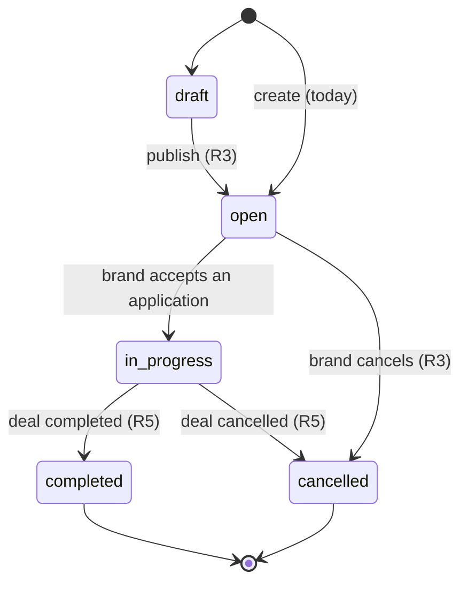
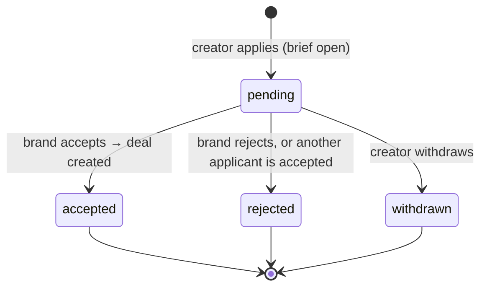
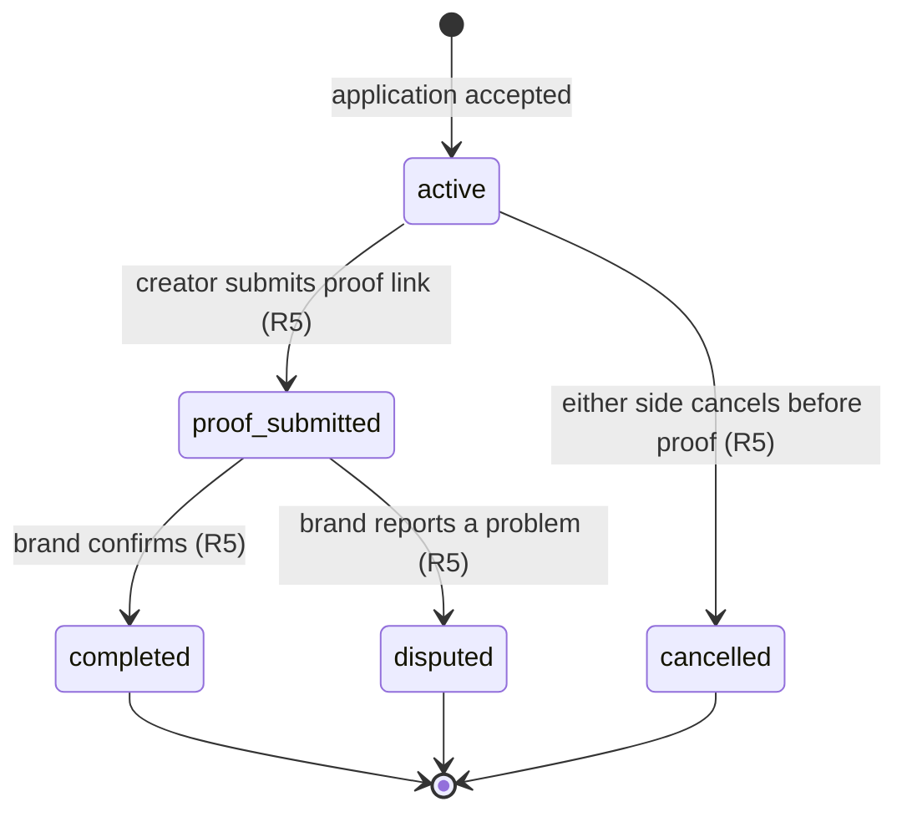

# ADR 0001 — One Deal pipeline: Brief → Application → Deal

- **Status:** accepted (2026-10-04, PR R2)
- **Decision owner:** product decision D1 in `tasks/todo.md`

## Context

Before R2 the app had three overlapping ways to record that a brand and a creator work together:

1. **Orders and applications.** A brand posts an order (a brief), creators apply, the brand accepts one.
2. **Matches.** A "connect" button and the matching recommendations created a `match` row, and accepting an application upserted one too. Matches carried hand-typed statistics (`stats`, `engagementRate`, …) that fed the Statistics dashboards.
3. **Collaborations.** A third table with its own status (`active`, `completed`, `cancelled`) that nothing in the UI created.

Each had its own status list, and none of them could say what happens after the brand accepts: whether the creator posted, whether the brand confirmed, or who may change what. The core loop in `docs/PRODUCT-BRIEF.md` needs exactly that: *brief → applicants → accept → deal → proof → confirm → ratings*.

## Decision

There is one pipeline. A **brief** (today the `orders` table; R3 renames the fields) collects **applications**; accepting an application creates exactly one **deal**. Match, Collaboration, the recommendation endpoints and the Statistics module are removed, with their tables.

- The accept transaction (order row locked) moves the order to `in-progress`, accepts the application, rejects the other pending applications and inserts the deal. The deal is unique per application (`deals.applicationId` unique), so a retried accept cannot create a second one.
- The deal copies the terms at the moment of acceptance: agreed price in ₸ (the creator's proposed price, else the brief budget), deliverables and post-by date. Later edits to the brief do not change an agreed deal.
- Every deal status change goes through one transition table (`backend/src/deals/deal-transitions.ts`) and a compare-and-set update, so two concurrent changes cannot both win.
- Money never moves through the platform: the deal page says "payment off-platform".
- Participants see each other's public identity only (name, avatar, profile); emails are never returned on these paths (decision D5). They talk in chat, which can only be opened between users who share an application or a deal.
- The match score survives as a pure function (`backend/src/profiles/match-score.ts`) over two profiles. R3 uses it to rank applicants on the server.

## Lifecycles

### Brief (order)

### Application

### Deal

| From | Allowed to |
|---|---|
| `active` | `proof_submitted`, `cancelled` |
| `proof_submitted` | `completed`, `disputed` |
| `completed`, `disputed`, `cancelled` | — (terminal) |

Disputes are resolved by the team outside the product for now; an admin resolution path is a later decision.

### The deal page stepper

The mockup shows four steps. They map onto the statuses as follows:

| Step | Shown as done when the status is |
|---|---|
| Accepted | any |
| Creating | `active` (current step) or later |
| Proof sent | `proof_submitted`, `completed`, `disputed` |
| Completed | `completed` |

`disputed` and `cancelled` show a status pill instead of advancing the stepper.

## Consequences

- One status vocabulary per object; the UI's Deals tab lists deals, not matches.
- The R2 migration drops `match` and `collaboration` (production has never been deployed, so no data is migrated). Dev databases on `synchronize` keep the old tables until they are dropped by hand.
- Proof, confirm, dispute and ratings (R5) only add endpoints that call the transition table; the schema already has the statuses.
- Hand-typed campaign statistics are gone. Creator statistics come back in R4 as self-reported numbers checked by an admin.
