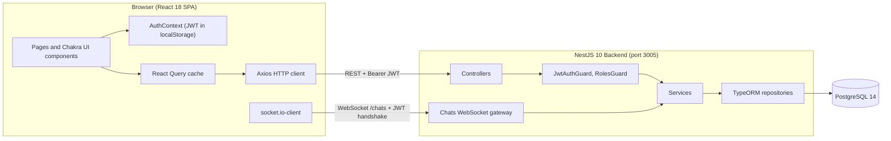
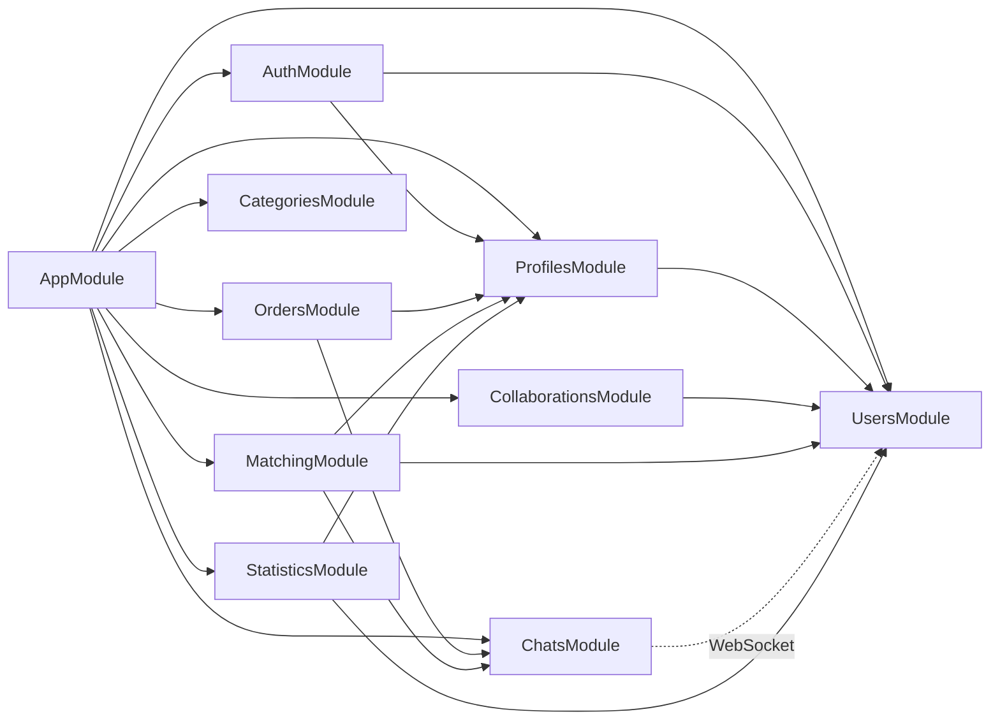
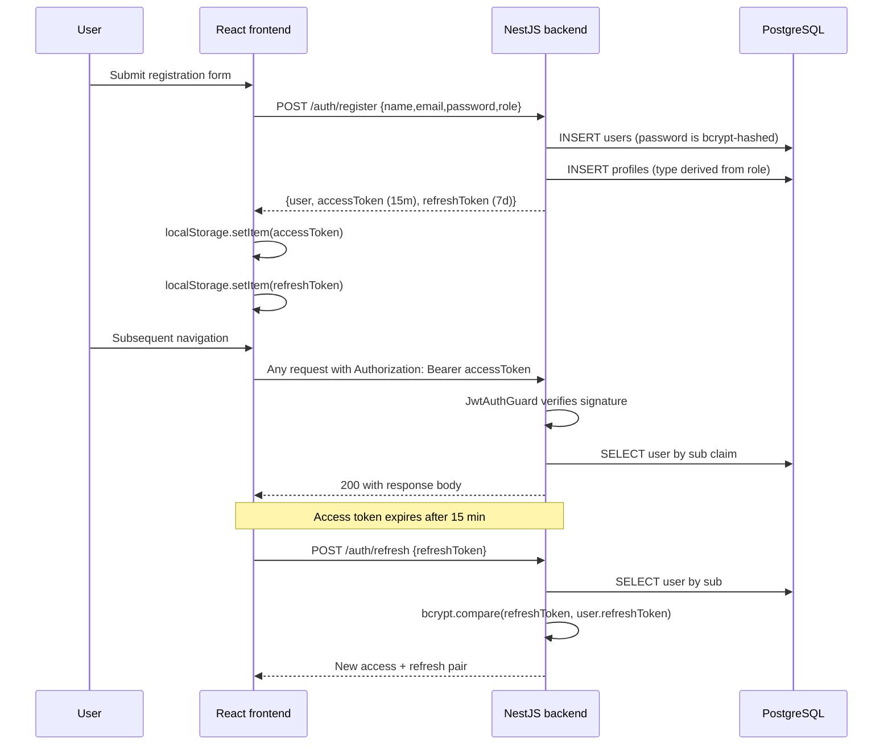
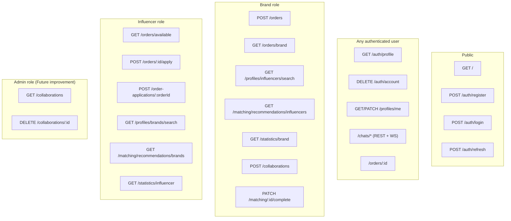
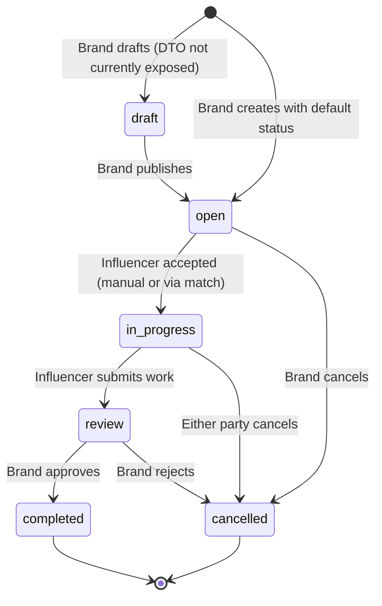
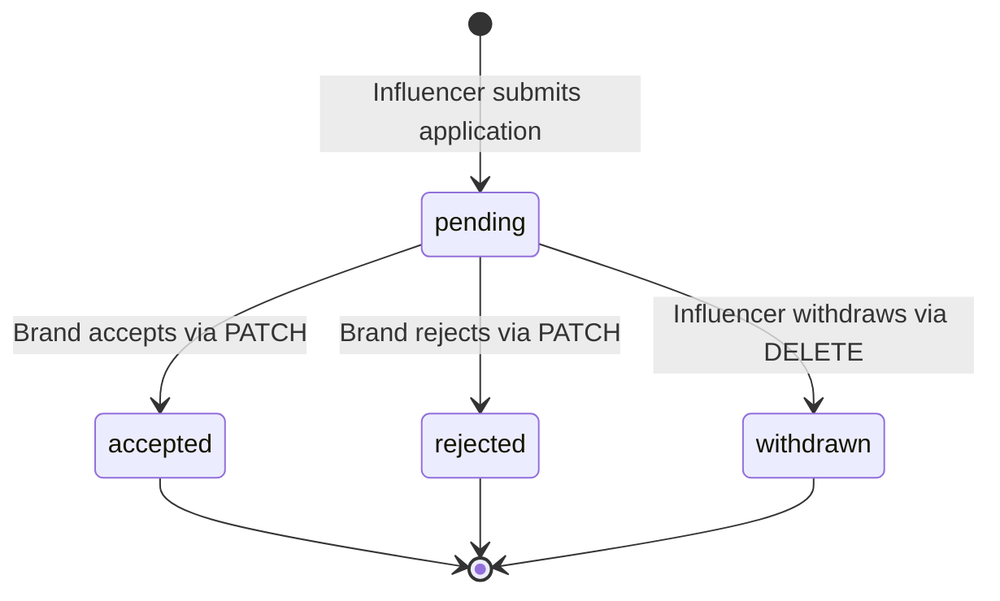
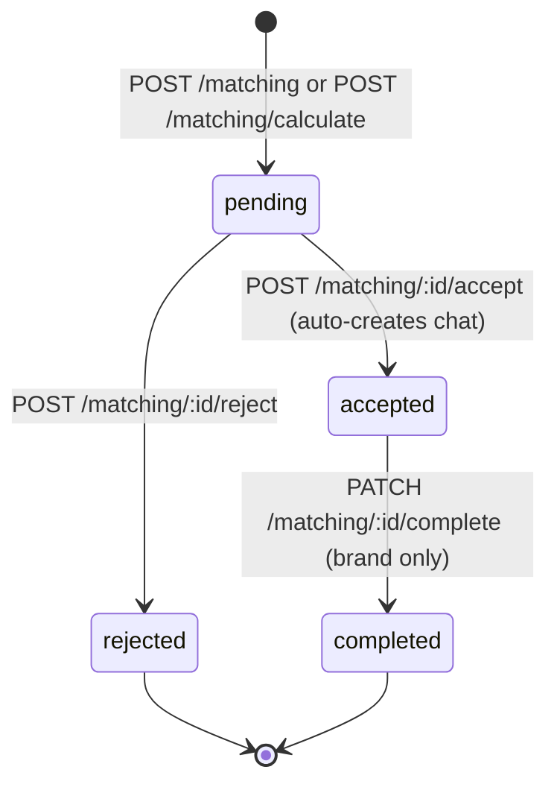
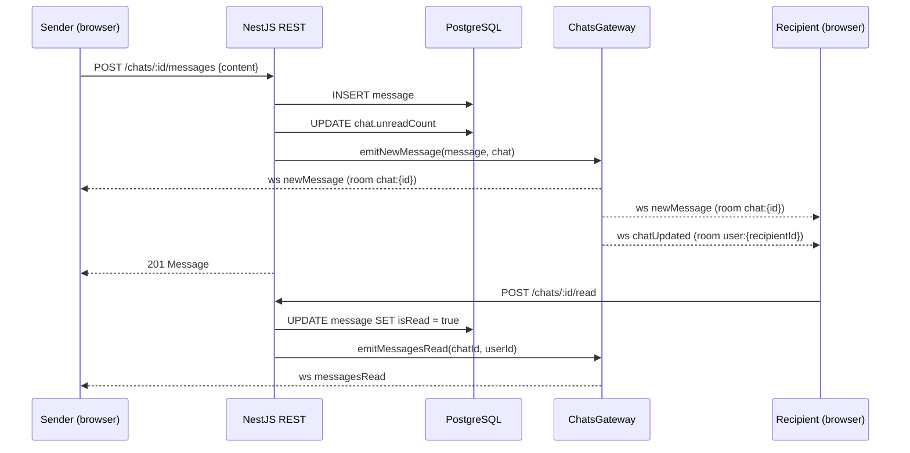

# 04 — Technical Documentation

This document describes the technical architecture of AdPartners.kz: the system topology, the responsibilities of each layer, the major modules and their dependencies, the authentication flow, the role model, the database relationships, and the principal workflows. It is intended for developers, the project supervisor, and the diploma defense committee.

## 1. System architecture overview

AdPartners.kz follows a classical three-tier architecture: a single-page React frontend, a NestJS REST and WebSocket backend, and a PostgreSQL database. The frontend communicates with the backend over HTTPS for REST and over a WebSocket connection (Socket.io) for real-time messaging. The backend persists data through TypeORM.



### Tier responsibilities

| Tier | Technology | Responsibility |
|---|---|---|
| Presentation | React 18, Chakra UI, React Router 6, React Query 5, React Hook Form, Recharts, socket.io-client | Render pages, capture user input, manage auth state in `AuthContext`, cache server data, render charts. |
| Application | NestJS 10 controllers, services, guards, the Chats WebSocket gateway, the global ValidationPipe and TransformInterceptor | Validate input, enforce authorization, run business logic (matching score, recommendations, statistics aggregation), broadcast real-time events. |
| Data | PostgreSQL 14, TypeORM 0.3 entities | Store users, profiles, social-media handles, orders, applications, matches, collaborations, chats, and messages. |

## 2. Frontend architecture

The frontend is a Create-React-App project ([frontend/package.json](../../frontend/package.json)) bootstrapped through `react-scripts`. Routing, providers, and the layout shell are wired in [frontend/src/App.tsx](../../frontend/src/App.tsx).

### Provider stack

```
ChakraProvider (theme)
└── QueryClientProvider (React Query)
    └── AuthProvider (login state, role, tokens)
        └── BrowserRouter
            └── AppRoutes (public + role-gated)
```

### Folder structure

| Folder | Contents |
|---|---|
| `pages/` | Top-level page components mapped 1:1 to routes (Landing, Login, Register, Profile, EditProfile, Messages, Matches, MatchDetail, Settings). |
| `pages/brand/` | Brand-only pages (Dashboard, Orders, CreateOrder, InfluencerList, InfluencerRecommendations, Influencers, MatchRecommendations, Messages, Campaigns). |
| `pages/influencer/` | Influencer-only pages (Dashboard, Orders, OrderDetail, MyApplications, BrandList, BrandRecommendations). |
| `components/` | Reusable UI: layout shell (`DashboardLayout`), chart wrappers (`statistics/*`), modals (`UpdateStatsModal`), guards (`auth/PublicRoute`), atoms (`Logo`, `IconWrapper`, `LoadingSpinner`, `SearchIcon`). |
| `contexts/` | `AuthContext` (login, register, logout, deleteAccount, refreshUser). |
| `services/` | Axios instance and one HTTP module per backend domain plus a Socket.io wrapper. |
| `types/` | Shared TypeScript interfaces. |
| `mocks/` | Inactive mock data (commented out). |

### Routing model

`ProtectedRoute` ([frontend/src/App.tsx:36-52](../../frontend/src/App.tsx#L36-L52)) wraps every authenticated route. It checks `isAuthenticated` from `AuthContext` and, when a `roles` prop is passed, verifies that `user.role` is in the allowed list. If the user is unauthenticated they are redirected to `/`; if their role is wrong they are redirected to their own dashboard.

## 3. Backend architecture

The backend is a single NestJS application. The bootstrap sequence in [backend/src/main.ts](../../backend/src/main.ts):

1. `NestFactory.create(AppModule)` constructs the IoC container.
2. CORS is enabled (`app.enableCors()`).
3. The global `ValidationPipe` is registered for DTO validation.
4. The global `TransformInterceptor` ([backend/src/common/interceptors/transform.interceptor.ts](../../backend/src/common/interceptors/transform.interceptor.ts)) wraps responses to avoid circular reference issues during entity serialization.
5. Swagger is configured at `/docs` via `DocumentBuilder` with bearer-auth.
6. The application listens on `process.env.PORT || 3000`. The compose file overrides this to `3005`.

### Module dependency graph



### Backend module reference

| Module | Controllers | Key services | Responsibilities |
|---|---|---|---|
| `AuthModule` | `AuthController` | `AuthService`, `JwtStrategy` | Registration, login, refresh-token rotation server-side, account deletion. |
| `UsersModule` | `UsersController` | `UsersService` | User CRUD plus influencer/brand directory search. |
| `ProfilesModule` | `ProfilesController` | `ProfilesService` | Brand/influencer profile management, role-gated counterpart search. The controller exposes only `GET/PATCH /profiles/me`, role-restricted search, and a read-only `GET /profiles/:userId`. |
| `OrdersModule` | `OrdersController`, `OrderApplicationsController` | `OrdersService`, `OrderApplicationsService` | Order lifecycle and application workflow. |
| `CollaborationsModule` | `CollaborationsController` | `CollaborationsService` | Long-running brand–influencer collaboration records. |
| `MatchingModule` | `MatchingController` | `MatchingService` | Match lifecycle, recommendation engine, match-score calculation. |
| `ChatsModule` | `ChatsController` | `ChatsService`, `ChatsGateway` | REST chat creation, message persistence, WebSocket delivery. |
| `CategoriesModule` | `CategoriesController` | — | Returns the static category list used by the dashboards (`GET /categories`, JWT-guarded). |
| `StatisticsModule` | `StatisticsController` | `StatisticsService` | Brand and influencer dashboard analytics. |

## 4. Authentication flow

The full flow is implemented in [backend/src/auth/auth.service.ts](../../backend/src/auth/auth.service.ts) and [backend/src/auth/strategies/jwt.strategy.ts](../../backend/src/auth/strategies/jwt.strategy.ts).



### Implementation notes

- Refresh tokens are bcrypt-hashed before being persisted in `users.refreshToken`. On refresh, the bcrypt hash is verified against the supplied raw token.
- The frontend currently does not implement automatic refresh on a 401: the Axios response interceptor in [frontend/src/services/api.ts](../../frontend/src/services/api.ts) clears tokens and redirects to `/login`. Adding silent refresh is listed as a `Future improvement`.
- The default JWT secret in [backend/src/config/configuration.ts:13](../../backend/src/config/configuration.ts#L13) is `super-secret`; production must override `JWT_SECRET`.

## 5. Role-based access map



## 6. Database relationships (ER diagram)

The relationships shown below are derived from the TypeORM decorators on each entity. See `05_DATABASE_DOCUMENTATION.md` for the field-level reference.

```mermaid
erDiagram
  USERS ||--|| PROFILES : "has 1"
  PROFILES ||--o{ SOCIAL_MEDIA : "has many"
  PROFILES ||--o{ ORDERS : "as brand"
  PROFILES ||--o{ ORDERS : "as influencer (optional)"
  USERS ||--o{ ORDERS : "as brand user"
  ORDERS ||--o{ ORDER_APPLICATION : "has many"
  USERS ||--o{ ORDER_APPLICATION : "as applicant"
  USERS ||--o{ MATCH : "as brand"
  USERS ||--o{ MATCH : "as influencer"
  USERS ||--o{ COLLABORATION : "as brand"
  USERS ||--o{ COLLABORATION : "as influencer"
  ORDERS ||--o{ COLLABORATION : "optional link"
  USERS ||--o{ CHAT : "as sender"
  USERS ||--o{ CHAT : "as recipient"
  CHAT ||--o{ MESSAGE : "contains"
  USERS ||--o{ MESSAGE : "as sender"
  USERS ||--o{ MESSAGE : "as recipient"

  USERS { uuid id email password role }
  PROFILES { uuid id type displayName industry categories }
  SOCIAL_MEDIA { uuid id type url username followers }
  ORDERS { uuid id title budget category status }
  ORDER_APPLICATION { uuid id message proposedPrice status }
  MATCH { uuid id status engagementRate stats }
  COLLABORATION { uuid id status orderId }
  CHAT { uuid id unreadCount }
  MESSAGE { uuid id content isRead }
```

## 7. Order workflow (state machine)



The values come from the `OrderStatus` enum in [backend/src/orders/entities/order.entity.ts:16-23](../../backend/src/orders/entities/order.entity.ts#L16-L23). Default status on creation is `open`.

## 8. Order application workflow (state machine)



## 9. Match workflow (state machine)



Acceptance calls `ChatsService.create` and `ChatsService.addMessage` to seed an initial chat between the parties (`backend/src/matching/matching.service.ts`).

## 10. Messaging sequence (REST + WebSocket)



The gateway is implemented in [backend/src/chats/chats.gateway.ts](../../backend/src/chats/chats.gateway.ts) and the controller in [backend/src/chats/chats.controller.ts](../../backend/src/chats/chats.controller.ts).

## 11. Recommendation algorithm

The matching engine is implemented in [backend/src/matching/matching.service.ts](../../backend/src/matching/matching.service.ts).

```
score(brand, influencer) = w_category × categoryMatch
                         + w_audience × audienceMatch
                         + w_engagement × engagementScore

w_category   = 0.4
w_audience   = 0.3
w_engagement = 0.3

categoryMatch   = Jaccard(brand.categories, influencer.categories)
                = |B ∩ I| / |B ∪ I|

audienceMatch   = 0.6 × Jaccard(brand.languages, influencer.languages)
                + 0.4 × Jaccard(brand.contentTypes, influencer.contentTypes)
                  (falls back to whichever of the two signals is available)

engagementScore = 0.7 × min(influencer.engagementRate, 1)
                + 0.3 × min(influencer.followers / 100000, 1)
```

The implementation lives in `MatchingService.calculateMatchScore`, `calculateCategoryMatch`, `calculateAudienceMatch`, and `calculateEngagementScore` ([backend/src/matching/matching.service.ts](../../backend/src/matching/matching.service.ts)). Every factor is deterministic — there are no random terms.

`getRecommendedInfluencersForBrand(brandId, limit=10)` and `getRecommendedBrandsForInfluencer(influencerId, limit=10)` fetch the counterpart users, exclude users with whom a Match already exists, score the rest by `categoryMatch` (Jaccard, already × 100), sort descending, and return the top `limit` items as `{ user, matchScore }[]`. Wiring the full three-factor score into the recommendation listings is a documented future improvement (FI-005); the score itself is already exposed by `POST /matching/calculate`.

## 12. Project folder structure

```
diploma-main/
├── backend/
│   ├── src/
│   │   ├── auth/        Registration, login, JWT, guards, decorators
│   │   ├── users/       User entity and CRUD
│   │   ├── profiles/    Profile + SocialMedia
│   │   ├── brands/      Standalone brand CRUD (parallel)
│   │   ├── orders/      Order + OrderApplication
│   │   ├── collaborations/
│   │   ├── matching/    Match + recommendations + score
│   │   ├── chats/       REST + WebSocket gateway
│   │   ├── categories/  Static category list endpoint
│   │   ├── statistics/  Brand and influencer aggregates
│   │   ├── common/      TransformInterceptor
│   │   ├── config/      configuration.ts (env loader)
│   │   ├── migrations/  Two TypeORM migrations
│   │   ├── scripts/     Maintenance scripts
│   │   ├── app.module.ts
│   │   └── main.ts
│   ├── package.json
│   └── Dockerfile
├── frontend/
│   ├── src/
│   │   ├── pages/       Public + role-gated pages
│   │   ├── components/  Layout, charts, modals, atoms
│   │   ├── contexts/    AuthContext
│   │   ├── services/    HTTP and WebSocket clients
│   │   ├── types/       Shared TypeScript types
│   │   ├── theme.ts
│   │   ├── App.tsx
│   │   └── index.tsx
│   └── package.json
├── docker-compose.yml
└── docs/diploma/        Documentation set produced by this audit
```

## 13. Environment variables

| Variable | Where | Purpose | Default |
|---|---|---|---|
| `PORT` | backend/src/config/configuration.ts | HTTP listen port | `3000` (compose overrides to `3005`) |
| `DB_HOST` | configuration.ts | PostgreSQL hostname | `localhost` (compose: `postgres`) |
| `DB_PORT` | configuration.ts | PostgreSQL port | `5432` |
| `DB_USERNAME` | configuration.ts | DB user | `postgres` |
| `DB_PASSWORD` | configuration.ts | DB password | `postgres` |
| `DB_NAME` | configuration.ts | DB name | `diploma` (compose: `influencer_platform`) |
| `NODE_ENV` | configuration.ts | Toggles `synchronize` (off only when `production`) | unset |
| `JWT_SECRET` | configuration.ts | Symmetric signing key | `super-secret` ← **must override in production** |
| `REACT_APP_API_BASE_URL` | frontend/src/services/api.ts | Backend base URL | `http://localhost:3005` |

## 14. Deployment setup

`docker-compose up` boots two containers:

| Container | Image | Port mapping | Notes |
|---|---|---|---|
| `influencer_platform_db` | `postgres:14-alpine` | `5435:5432` | Volume `postgres_data` for persistence; healthcheck via `pg_isready`. |
| `influencer_platform_backend` | Built from `backend/Dockerfile` (target `development`) | `3005:3005` | Mounts the backend source for hot-reload; runs `npm install && npm run build && npm run start:dev`. |

The frontend is run separately in development with `npm start` from `frontend/`. There is no production Dockerfile or CI/CD configuration in the repository; production hosting is a future deliverable.

## 15. Security considerations

| Area | Current state | Recommendation |
|---|---|---|
| Password storage | bcrypt hashing on registration ([auth.service.ts:25](../../backend/src/auth/auth.service.ts#L25)). | Acceptable. |
| JWT secret | Default `super-secret`. | Must be overridden via env in production. |
| Refresh token storage | bcrypt-hashed in `users.refreshToken`. | Acceptable. |
| Frontend token storage | `localStorage` for both access and refresh. | Move refresh token to HTTP-only cookie. |
| CORS | `app.enableCors()` (allow-all). | Restrict to the production frontend origin. |
| Input validation | Global `ValidationPipe` enforces all DTO decorators. | Acceptable. |
| Mass-assignment | Most controllers accept full DTOs derived from `class-validator`; some endpoints (e.g. `/profiles`, `/messages`) accept `Partial<Entity>` directly. | Replace `Partial<Entity>` parameters with explicit DTOs in a follow-up. |
| Debug endpoints | All maintenance endpoints live under `/chats/admin/*` (`/chats/admin/debug-messages/:chatId`, `/chats/admin/fix-messages`, `/chats/admin/fix-messages/sql`, `/chats/admin/messages/:chatId/direct`), restricted to `@Roles(UserRole.ADMIN)`, and excluded from the public Swagger document via `@ApiExcludeEndpoint()`. | Already enforced. |
| Rate limiting | None. | Add NestJS `@nestjs/throttler` for `/auth/*`. |

## 16. Scalability and maintainability considerations

| Topic | Current state | Notes |
|---|---|---|
| Stateless backend | The NestJS process holds no per-user state except for in-memory socket maps in `ChatsGateway`. | For multi-instance deployment, replace the in-memory maps with Redis adapter for Socket.io. |
| Database indexes | Only the implicit primary keys and unique constraints on `users.email`. | Add indexes on `Match.brandId`, `Match.influencerId`, `Order.category`, `Message.chatId`, etc. |
| TypeORM `synchronize:true` | Enabled in non-production. | Replace with explicit migrations before scaling. |
| File uploads | Not implemented; avatars and assets are external URLs. | If introduced, integrate `@nestjs/platform-express` `Multer` and an object store (S3 / MinIO). |
| Background jobs | Not present. | Stats aggregation should be moved to a periodic job (BullMQ) once daily aggregation is implemented. |
| Logging | NestJS default `Logger`. | Add structured logging (e.g. `nestjs-pino`). |
| Code modularity | Each domain has its own NestJS module. | Healthy starting point; the `messages` and `brands` legacy modules should be consolidated. |

## 17. Limitations (mapped to "Future improvement" markers)

- No admin user interface; the `admin` role is recognized only at the API layer.
- No notifications subsystem (e-mail, in-app push, or SMS).
- No file uploads; profile avatars are external URLs.
- Frontend does not perform automatic refresh-token rotation on 401.
- The recommendation listing endpoints rank by `categoryMatch` only; the full three-factor score is computed in `calculateMatchScore` but not yet integrated into the listing path (FI-005).
- Daily-stat aggregation in `StatisticsService` is a future improvement (FI-006); the dashboard line chart is currently illustrative.
- The `influencers` backend module is an empty shell.
- The `Brand` and `messages` modules are parallel/legacy; consolidation is pending.
- The root-level `src/matching` and `src/orders` are abandoned prototype code.
